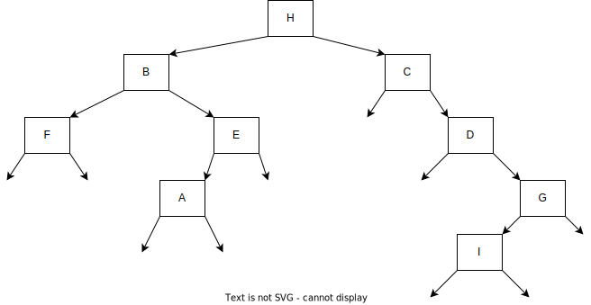
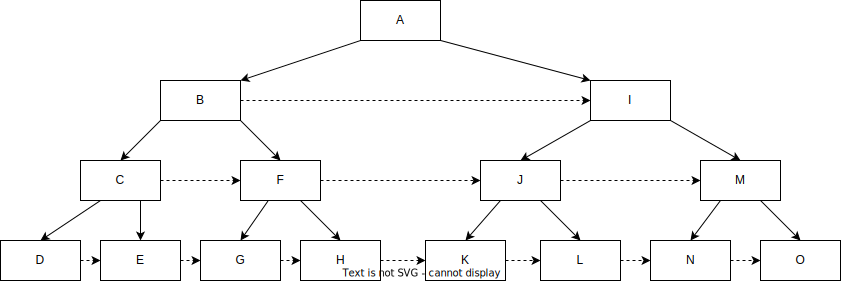

# 9장 이진 트리

이진 트리는 계층을 표현하는 데 유용한 자료구조로, 각 노드가 최대 두 개의 자식을 가지는 트리를 말한다. 형식상 이진 트리는 비어 있거나, 루트 노드 r과 함께 왼쪽 이진 트리 및 오른쪽 이진 트리로 구성된다. 각각의 부분 트리도 이진 트리의 형식을 만족해야 한다. 왼쪽 이진 트리는 루트의 왼쪽 부분 트리, 오른쪽 이진 트리는 루트의 오른쪽 부분 트리라 한다.

노드에는 보통, 다른 노드를 가리키기 위한 데이터 외에도 추가 데이터가 저장된다. 다음 코드는 노드의 프로토타입을 나타낸다.

```java
public static class BinaryTreeNode<T> {
    public T data;
    public BinaryTreeNode<T> left, right;
}
```

루트를 제외한 노드는 왼쪽 부분 트리 혹은 오른쪽 부분 트리의 노드이다. l이 p의 왼쪽 부분 트리의 노드라면 l을 p의 왼쪽 자식일아고 하고, p를 l의 부모라고 할 것이다. 오른쪽 자식도 마찬가지이다. 어떤 노드가 p의 왼쪽 혹은 오른쪽 자식이라면, 해당 노드는 p의 자식이다. 루트를 제외한 모든 노드는 유일한 부모 노드를 가지고 있다는 사실을 명심하라. 노드 객체에 부모를 가리키는 참조 변수가 있을 수도 있다(루트의 경우에는 null이 된다). 모든 노드는 루트 노드에서 해당 노드까지의 유일한 경로를 가지고 있고 그 경로에 있는 노드들은 자식 노드의 시퀀스로 이루어져 있다. 가끔 이 경로를 루트 노드에서 해당 노드까지의 탐색 경로라 하기도 한다.

이진 트리에서 부모-자식 관계는 조상-자손의 관계를 정의하기도 한다. 즉, 루트 노드에서 d 노드까지의 탐색 경로상에 있는 노드들은 d 노드의 조상 노드가 된다. 어떤 노드가 d의 조상이라면 d는 해당 노드의 자손이 된다. 관습적으로 각 노드는 자기 자신의 조상 노드이면서 자손 노드가 된다. 자기 자신 외에 자손이 없는 노드는 단말(leaf) 노드라 한다.

노드 n의 깊이는 루트 노드에서 n까지의 탐색 경로상에서 노드 n을 제외한 나머지 노드의 개수와 같다. 이진 트리의 높이는, 가장 깊은 노드의 깊이와 같다. 트리의 레벨은 같은 깊이에 있는 모든 노드를 뜻한다. 



노드 I는 J와 O의 부모이다. 노드 G는 B의 자손이다. L까지의 탐색 경로는 <A,I,J,K,L>이다. N의 깊이는 4이다. 노드 M이 가장 깊으므로 트리의 높이는 노드 M의 높이인 5이다. B를 루트로 한 부분 트리의 높이는 3이다. H를 루트로 한 부분 트리의 높이는 0이다. D,E,H,M,P는 트리의 단말 노드이다.

전 이진 트리(full binary tree)는 단말 노드를 제외한 모든 노드의 자식이 두 개인 트리를 말한다. 포화 이진 트리(perfect binary tree)는 전 이진 트리이면서 단말 노드의 깊이가 모두 같은 트리를 말한다. 완전 이진 트리(complete binary tree)는 마지막을 제외한 모든 레벨에서 노드가 완전히 채워져 있고, 모든 노드는 가능하면 왼쪽에 있는 트리를 말한다. 전 이진 트리에서 단말 노드가 아닌 노드의 개수가 단말 노드의 개수보다 하나 적다. 이는 귀납법을 사용하면 쉽게 증명할 수 있다. 높이가 h인 포화 이진 트리의 노드의 개수는 정확히 2^(h+1)-1개이고, 단말 노드의 개수는 2^h개이다. 노드가 n개인 완전 이진 트리의 높이는 floor(log n)이다. 오른쪽 자식이 없는 트리를 왼쪽으로 치우친 트리(left-skewed tree)라고 한다. 왼쪽 자식이 없는 트리는 오른쪽으로 치우친 트리(right-skewed tree)라 한다.

이진 트리의 핵심 연산은 모든 노드를 순회하는 연산이다(순회를 걷는다고도 표현한다). 여기에 몇 가지 순회 방법이 있다.

- 왼쪽 부분 트리, 루트, 오른쪽 부분 트리 순으로 순회하는 중위 순회(inorder traversal)가 있다. 위 그림의 트리를 중위 순회하면 다음과 같은 순서로 방문한다. <D,C,E,B,F,H,G,A,J,L,M,K,N,I,O,P>
- 루트, 왼쪽 부분 트리, 오른쪽 부분트리 순으로 순회하는 전위 순회(preorder traversal)가 있다. <A,B,C,D,E,F,G,H,I,J,K,L,M,N,O,P>
- 왼쪽 부분 트리, 오른쪽 부분 트리, 루트 순으로 순회하는 후위 순회(postorder traversal)가 있다. <D,E,C,H,G,F,B,M,L,N,K,J,P,O,I,A>

노드가 n개이고 높이가 h인 이진 트리 T가 있다고 가정하자. 재귀로 구현하면 순회의 시간 복잡도는 O(n), 공간 복잡도는 O(h)가 된다(공간 복잡도는 함수 호출 스택의 최대 깊이와 같다). 만약 각 노드에 부모를 가리키는 변수가 존재하면 O(1)의 추가 공간 복잡도만을 사용해서 순회할 수 있다.

트리의 종류가 다양하다. 그중에서 자주 사용되는 트리는 18장에서 간략히 설명한다.

## 이진 트리 부트캠프

이진 트리를 빠르게 이해하려면 기본적인 세 가지 순회방법(중위, 전위, 후위 순회)를 직접 구현해 보는 것이 좋다.

```java
public static void treeTraversal(BinaryTreeNode<Integer> root) {
    if (root != null) {
        // 전위 순회: 왼쪽 자식과 오른쪽 자식을 순회하기 전에 루트를 먼저 처리하는 방법
        System.out.println("Preorder: " + root.data);
        treeTraversal(root.left);
        // 중위 순회: 오른쪽 자식을 순회하기 위해 루트를 먼저 처리하고 그 다음에 왼쪽 자식을 순회하는 방법
        System.out.println("Ineorder: " + root.data);
        treeTraversal(root.right);
        // 후위 순회: 왼쪽 자식과 오른쪽 자식을 순회한 다음에 루트를 처리하는 방법
        System.out.println("Posteorder: " + root.data);
    }
}
```

노드가 n개일 때, 각 방법의 시간 복잡도는 O(n)이다. 명시적으로 메모리를 할당하지 않더라도 함수 호출 스택의 최대 깊이는 트리의 높이인 h에 근접하게 된다. 따라서 공간 복잡도는 O(h)가 된다. h의 하한값은 log n(완전 이진 트리)이고 상한 값은 n(한쪽으로 치우친 트리)이다.

## 이진 트리 문제를 풀기 전 꼭 알고 있어야 할 내용

- `재귀 알고리즘`은 트리에 적합하다. `함수 호출 스택`에 암묵적으로 할당된 공간은 공간 복잡도를 분석할 때 포함시켜야 한다.[문제 9.1]
- 어떤 트리 문제는 O(n) 공간을 사용한 쉬운 해법이 존재하지만 `주어진 트리의 노드`를 사용해서 공간 복잡도를 O(1)로 줄이는 까다로운 해법도 존재한다.[문제 9.14]
- 복잡도를 분석할 때 `왼쪽 혹은 오른쪽으로 치우친 트리`를 고려해 보라. 트리의 높이가 h일 때 O(h) 복잡도는 균형 잡힌 트리에서 O(log n)이지만 치우친 트리에서 O(n)이 된다. [문제 9.12]
- 노드에 `부모를 가리키는 변수`가 있다면, 코드를 좀 더 깔끔하게 작성할 수 있고 시간 및 공간 복잡도도 줄일 수 있다.[문제 9.10]
- `하나 있는 자식`이 단말 노드인 경우, `실수`하기 쉬우므로 유의한다.[문제 9.6]

## 문제 9.1 이진 트리의 높이가 균형 잡혀 있는지 확인하기

트리의 모든 노드에 대해서 왼쪽 부분 트리의 높이와 오른쪽 부분 트리의 높이의 차이가 최대 1이라면 해당 트리는 균형 잡혔다고 한다. 균형 잡힌 트리는 포화 이진 트리이거나 완전 이진 트리일 필요는 없다.


이진 트리의 루트 노드가 입력으로 주어졌을 때 해당 트리가 균형 잡혀 있는지 확인하는 프로그램을 작성하라.

> 고전적인 이진 트리 알고리즘을 생각해 보라.

무식한 방법은 다음과 같다. 재귀적으로 각 노드를 루트로 한 부분 트리의 높이를 계산한다. 단말 노드에서 시작해 위로 올라가면서 높이를 구하는 것이다. 각 노드에서 왼쪽 자식과 오른쪽 자식의 높이의 차이가 1 이상인지 확인한다. 각 높이를 해시 테이블에 저장하거나 노드 안에 새로운 변수를 추가해서 높이 정보를 저장할 수 있다. 이 방법은 노드가 n개일 때 $O(n)$의 시간 및 공간 복잡도를 사용한다.

하지만 모든 노드의 높이를 전부 저장할 필요는 없다. 부분 트리를 모두 처리한 뒤에는 해당 트리가 균형 잡혀 있는지, 해당 트리의 높이가 무엇인지만 알면 되므로 공간 복잡도를 더 줄일 수 있다. 또한 부분 트리의 자손에 대한 정보는 필요 없다.

```java
private static class BalanceStatusWithHeight {
    public boolean balanced;
    public int height;

    public BalanceStatusWithHeight(boolean balanced, int height) {
        this.balanced = balanced;
        this.height = height;
    }
}

public static boolean isBalanced(BinaryTreeNode<Integer> tree) {
    return checkBalanced(tree).balanced;
}

private static BalanceStatusWithHeight checkBalanced(
    BinaryTreeNode<Integer> tree
) {
    if (tree == null) {
        return new BalanceStatusWithHeight(true, -1);
    }

    BalanceStatusWithHeight leftResult = checkBalanced(tree.left);
    if (!leftResult.balanced) {
        return leftResult; // 왼쪽 부분 트리가 균형 잡히지 않았다.
    }

    BalanceStatusWithHeight rightResult = checkBalanced(tree.right);
    if (!rightResult.balanced) {
        return rightResult; // 오른쪽 부분 트리가 균형 잡히지 않았다.
    }

    boolean isBalanced = Math.abs(leftResult.height - rightResult.height) <= 1;
    int height = Math.max(leftResult.height, rightResult.height) + 1;
    return new BalanceStatusWithHeight(isBalanced, height);
}
```

해당 프로그램은 후위 순회로 구현되어 있고, 일찍 끝마치는 로직 때문에 모든 경우를 호출하지 않을 수 있다. 즉, 만약 왼쪽 부분 트리가 균형 잡혀 있지 않다면 오른쪽 부분 트리를 방문할 필요가 없다. 함수 호출 스택의 호출 시퀀스는 루트에서 현재 노드까지의 유일한 경로와 같고, 따라서 스택의 높이의 상한은 트리의 높이가 되므로 공간 복잡도는 $O(h)$가 된다. 시간 복잡도는 후위 순회와 같으므로 $O(n)$이 된다.

## 문제 9.2 이진 트리가 대칭인지 확인하기

루트에 수직선을 그었을 때 왼쪽 부분 트리가 오른쪽 부분 트리를 거울에 비친 모습과 같다면 해당 이진 트리가 대칭이라고 말한다. 이진 트리가 대칭인지 확인하는 프로그램을 작성하라.

> 힌트: 대칭의 정의는 재귀적이다.

거울에 비친 트리를 계산한 뒤 기존 트리와 정확히 일치하는지 확인하면 된다. 거울에 비친 트리를 계산하는 간단한 방법은 왼쪽 부분 트리와 오른쪽 부분 트리를 재귀적으로 맞바꾸는 것이다. 노드가 n개일 떄 시간 및 공간 복잡도는 $O(n)$이 된다.

더 나은 알고리즘에서는 거울에 비친 트리를 만들지 않는다. 여기서는 부분 트리의 쌍이 서로 동일한지 아닌지만 판단하면 된다. 따라서 각 쌍이 동일하지 않는다는 사실을 확인하는 순간, 바로 false를 반환해서 코드 진행을 멈추면 된다.

```java
public static boolean isSymmetric(BinaryTreeNode<Integer> tree) {
    return tree == null || checkSymmetric(tree.left, tree.right);
}

private static boolean checkSymmetric(BinaryTreeNode<Integer> subtree0, BinaryTreeNode<Integer> subtree1) {
    if (subtree0 == null && subtree1 == null) {
        return true;
    } else if (subtree0 != null && subtree1 != null) {
        return subtree0.data == subtree1.data
            && checkSymmetric(subtree0.left, subtree1.right)
            && checkSymmetric(subtree0.right, subtree1.left);
    }
    // 부분 트리가 한쪽에만 존재하는 경우
    return false;
}
```

시간 복잡도는 $O(n)$이고, 공간 복잡도는 $O(h)$이다. 여기서 n은 노드의 개수이고 h는 트리의 높이다.

## 문제 9.3 이진 트리의 최소 공통 조상 구하기

이진 트리에서 임의의 두 노드는 루트라는 공통 조상을 가지고 있다. 이진 트리에서 임의의 두 노드의 최소 공통 조상(LCA)은 공통 조상 노드 중에서 루트에서 가장 먼 노드를 뜻한다.

최소 공통 조상을 구하는 건 중요한 작업이다. 예를 들어 웹 페이지를 렌더링할 때, 특히 특정 문서 객체 모델(DOM)에 적용할 캐스케이딩 스타일 시트(CSS)를 계산할 때 유용하다.

이진 트리에서 두 노드의 최소 공통 조상을 구하는 알고리즘을 설계하라. 단, 노드에 부모를 가리키는 변수는 존재하지 않는다.

> 힌트: 루트가 최소 공통 조상이 되는 때는 언제인가?

무식한 방법은 일단 두 노드가 루트의 다른 부분 트리에 속해 있거나 두 노드 중 하나가 루트인지 확인하는 것이다. 이 경우에는 루트가 최소 공통 조상이 된다. 만약 두 노드가 루트의 왼쪽 부분 트리 혹은 루트의 오른쪽 부분 트리에 속해 있다면 해당 부분 트리를 재귀 호출한다. 노드가 n개일 때 시간 복잡도는 $O(n^2)$이 된다. 최악의 경우는 한쪽으로 치우친 트리에서 두 노드가 트리의 가장 아래에 있을 때이다.

그런데 이 알고리즘은 여러 번 수행할 필요는 없다. 즉, 시간 복잡도를 개선할 수 있다. 두 노드가 같은 부분 트리에 있다면 두 노드가 부분 트리에 속해 있는지 불 값을 반환하지 않고 곧바로 최소 공통 조상을 구하면 된다. 다음 프로그램은 두 가지 정보를 담은 객체를 반환한다. 하나는 부분 트리에 존재하는 두 노드의 개수(0 혹은 1, 혹은 2)이고, 다른 하나는 두 노드가 해당 부분 트리에 있을 경우에 두 노드의 최소 공통 조상이다.

```java
private static class Status {
    public int numTargetNodes;
    public BinaryTreeNode<Integer> ancestor;

    public Status(int numTargetNodes, BinaryTreeNode<Integer> node) {
        this.numTargetNodes = numTargetNodes;
        this.ancestor = node;
    }
}

public static BinaryTreeNode<Integer> LCA(BinaryTreeNode<Integer> tree,
                                          BinaryTreeNode<Integer> node0,
                                          BinaryTreeNode<Integer> node1)
{
    return LCAHelper(tree, node0, node1).ancestor;
}

// 정수값과 노드로 구성된 객체를 반환한다. 정수형 변수는 {node0, node1}이
// 해당 트리에 몇 개 존재하는지에 따라 0, 1, 2의 값을 가진다.
// 만약 두 노드가 해당 트리에 존재하고, ancestor에 null이 아닌 값이 할당되어 있으면
// 해당 노드가 최소 공통 조상이다.
private static Status LCAHelper(BinaryTreeNode<Integer> tree,
                                BinaryTreeNode<Integer> node0,
                                BinaryTreeNode<Integer> node1)
{
    if (tree == null) {
        return new Status(0, null);
    }

    Status leftResult = LCAHelper(tree.left, node0, node1);
    if (leftResult.numTargetNodes == 2) {
        // 왼쪽 부분 트리에서 두 노드를 발견했다.
        return leftResult;
    }

    Status rightResult = LCAHelper(tree.right, node0, node1);
    if (rightResult.numTargetNodes == 2) {
        // 왼쪽 부분 트리에서 두 노드를 발견했다.
        return rightResult;
    }

    int numTargetNodes = leftResult.numTargetNodes + rightResult.numTargetNodes + (tree == node0 ? 1 : 0) + (tree == node1 ? 1 : 0)
    return new Status(numTargetNodes, numTargetNodes == 2 ? tree : null);
}
```

알고리즘은 구조적으로 후위 순회를 재귀적으로 구현한 방법과 비슷하고, 복잡도도 동일하다. 즉, 시간 복잡도는 $O(n)$, 공간 복잡도는 $O(h)$이다. 여기서 h는 트리의 높이다.

## 문제 9.4 노드에 부모를 가리키는 정보가 있을 때 최소 공통 조상 구하기

이진 트리에서 노드 두 개가 주어졌을 때 최소 공통 조상(LCA)을 구하는 알고리즘을 설계하라. 각 노드에는 부모를 가리키는 정보가 들어 있다.

> 힌트: 두 노드가 루트에서 같은 거리에 있다면 문제가 쉬워진다.

무식한 방법은 루트까지의 탐색 경로에 있는 모든 노드를 해시 테이블에 저장하는 것이다. 부모를 가리키는 정보가 노드에 있기 때문에 탐색 경로를 쉽게 구할 수 있다. 그 다음 두 번째 노드에서부터 위로 올라가면서 해시 테이블에 같은 노드가 있는지 확인한다. 이 방법의 시간 및 공간 복잡도는 $O(h)$이다. 여기서 h는 트리의 높이다.

두 노드 사이에 루트라는 공통 조상이 존재한다는 사실을 우리는 알고 있다. 만약 두 노드의 깊이가 같다면 같은 노드에 도달할 떄까지 동시에 한 칸씩 올라가면서 확인하면 된다. 하지만 두 노드의 깊이가 같지 않을 때는 첫 공통 노드가 무엇인지 알아내야 한다. 그러려면 순회한 노드의 집합을 알고 있어야 한다. 실제로 노드를 저장하는 것은 아니고, 깊이가 더 깊은 노드를 다른 노드의 깊이와 같아질 때까지 끌어올린 뒤에 두 노드를 동시에 한 칸씩 올라가는 우회 방법을 쓰면 된다.

예를 들어 트리 예에서 노드 M의 높이는 5, 탐색 경로는 <A, I, J, K, L, M>이고, 노드 P의 높이는 3, 탐색 경로는 <A, I, O, P>이다. 노드 M을 K까지 올려 깊이를 3으로 만든 뒤에 두 노드를 한 칸씩 올라간다면 첫 공통 노드는 I가 된다. 따라서 노드 I가 M과 P의 공통 조상이다.

부모 정보를 알고 있으므로 노드의 깊이를 구하는 방법은 간단해진다. 시간 복잡도는 %O(h)%이고, 공간 복잡도는 $O(1)$이다. 깊이를 알고 있다면 동시에 움직이면서 최소 공통 조상을 구할 수 있다. 여기서 h는 트리의 높이이다.

```java
public static BinaryTree<Integer> LCA(BinaryTree<Integer> node0, BinaryTree<Integer> node1) {
    int depth0 = getDepth(node0), depth1 = getDepth(node1);
    
    // 코드를 간단히 하기 위해서 node0을 항상 깊이가 같은 노드로 만든다.
    if (depth1 > depth0) {
        BinaryTree<Integer> temp = node0;
        node0 = node1
        node1 = temp;
    }

    // 깊이가 깊은 노드를 먼저 올린다.
    int depthDiff = Math.abs(depth0 - depth1);
    while (depthDiff-- > 0) {
        node0 = node0.parent;
    }

    // 최소 공통 조상에 도달할 때까지 두 노드를 동시에 올린다.
    while (node0 != node1) {
        node0 = node0.parent;
        node1 = node1.parent;
    }
    return node0;
}

private static int getDepth(BinaryTree<Integer> node) {
    int depth = 0;
    while (node.parent != null) {
        ++depth;
        node = node.parent;
    }
    return depth;
}
```

시간 복잡도는 $O(h)$이고 공간 복잡도는 $O(1)$이다. 이 복잡도는 깊이를 계산하는 복잡도와 동일하다.

## 문제 9.5 이진 트리에서 루트-단말 노드 경로의 합 구하기

각 노드가 0 혹은 1 값만 가지는 이진 트리를 생각해 보자. 루트-단말 노드 경로는 이진수로 표현될 수 있다. 여기서 최상위 비트(MSB)는 루트가 된다.

루트-단말 노드의 경로로 표현되는 이진 숫자의 합을 구하는 알고리즘을 설계하라.

> 힌트: 트리를 어떻게 순회해야 하는지 생각해 보라.

무식한 방법은 다음과 같다. 중위 순회를 통해 단말 노드를 구한 뒤, 자식-부모 관계를 해시 테이블에 저장한다. 그다음 자식-부모 매핑을 사용해서 모든 단말 노드에서 루트까지 순회한다. 각각의 단말 노드-루트 경로는 이진수로 표현될 것이고 단말 노드의 비트는 최하위 비트(LSB)가 된다. 이들의 합을 모두 구하면 된다. 루트-단말 노드 경로의 개수가 L(단말 노드의 개수와 같다), 트리의 높이가 h일 때 이 방법의 시간 복잡도는 $O(Lh)$가 된다. 모든 노드의 개수를 n이라 할 때 공간 복잡도는 해시 테이블의 크기만큼이므로 $O(n)$이 된다.

복잡도를 어떻게 개선할 수 있을까? 우선 경로상의 노드들이 중복되며, 이들을 반복적으로 계산할 필요가 없다는 사실을 이용해 보자. 루트에서 임의의 노드까지의 경로가 표현하는 숫자를 계산하기 위해서는 부모까지 표현된 숫자를 두 배한 뒤 현재 노드의 비트를 더해 주면 된다. 예를 들어 (책의 그림) A에서 L까지의 경로가 표현하는 숫자는 $2 * (1100)_2 + 1 = (11001)_2$가 된다.

따라서 다음 방법으로 루트에서 단말 노드까지의 모든 경로의 합을 구할 수 있다. 노드를 방문할 때마다 부모까지의 숫자를 이용해서 현재의 숫자를 계산한다. 만약 노드가 단말 노드라면 해당 정수값을 반환한다. 만약 단말 노드가 아니라면, 왼쪽 자식과 오른쪽 자식까지의 합을 반환한다.

```java
public static int sumRootToLeaf(BinaryTreeNode<Integer> tree) {
    return sumRootToLeafHelper(tree, 0);
}

private static int sumRootToLeafHelper(BinaryTreeNode<Integer> tree, int partialPathSum) {
    if (tree == null) {
        return 0;
    }

    partialPathSum = partialPathSum * 2 + tree.data;
    if (tree.left == null && tree.right == null) { // 단말 노드라면
        return partialPathSum;
    }
    // 단말 노드가 아닌 경우
    return sumRootToLeafHelper(tree.left, partialPathSum) + sumRootToLeafHelper(tree.right, partialPathSum);
}
```

시간 복잡도는 $O(n)$, 공간 복잡도는$O(h)$이다.

## 문제 9.6 주어진 합에 해당하는 루트-단말 노드 경로 구하기

각 노드가 정수값으로 표현된 이진 트리가 주어져 있다. 이러한 트리에서 어떤 노드의 경로 무게는 루트에서 해당 노드까지의 유일한 경로상에 있는 노드들의 정수의 합이다. 예를 들어 위 그림에서 E의 경로 무게는 591(314 + 6 + 271)이다.

어떤 정수값과 노드의 무게가 표현된 이진 트리가 주어졌을 때, 단말 노드까지의 경로 무게가 주어진 정수값과 같은 단말 노드가 존재하는지 확인하는 프로그램을 작성하라.

> 힌트: 특정 부분 트리를 확인하려면 나머지 트리에서 어떤 정보가 필요한가?

우선 무식한 방법을 생각해보자. 9.5의 해법에서 다루었던 무식한 방법을 이용하면 된다. 시간 복잡도 또한 $O(Lh)$로 동일하다. 여기서 L은 루트-단말 노드 경로의 개수(단말 노드의 개수와 같다)이고 h는 트리의 높이다. 모든 노드의 개수를 n이라 할 때 공간 복잡도는 해시 테이블의 크기만큼이므로 $O(n)$이 된다.

이 방법은 경로가 겹치고, 겹친 경로에서 구한 합의 정보를 공유하지 않아 비효율적이다.

트리를 순회하면서 루트-단말 노드 경로의 합을 미리 구해 놓는 방법이 더 낫다. 단말 노드까지의 경로 무게가 찾고자 하는 무게와 같은 단말 노드에 도달하면, 원하는 단말 노드를 찾은 것이다. 해당 단말 노드를 찾는 순간 순회를 마침으로써 단말 노드를 찾는 작업을 중단하도록 한다.

```java
public static boolean hasPathSum(BinaryTreeNode<Integer> tree, int targetSum) {
    return hasPathSumHelper(tree, 0, targetSum);
}

private static boolean hasPathSumHelper(BinaryTreeNode<Integer> node, int partialPathSum, int targetSum) {
    if (node == null) {
        return false;
    }
    partialPathSum += node.data;
    if (node.left == null && node.right == null) {
        return partialPathSum == targetSum;
    }
    return hasPathSumHelper(tree.left, partialPathSum, targetSum) ||
           hasPathSumHelper(tree.right, partialPathSum, targetSum);
}
```

시간 복잡도는 $O(n)$, 공간 복잡도는 $O(h)$이다.

## 문제 9.7 재귀를 사용하지 않고 중위 순회 구현하기

이번 문제는 이진 트리를 중위 순회한다. 이 장의 첫 부분에서 순회에 관한 자세한 내용과 예제를 다뤘다. 일반적으로 재귀를 사용하면 트리를 순회하는 구현은 쉬워진다.

이진 트리가 입력으로 주어졌을 때 트리를 중위 순회하는 프로그램을 작성하라. 재귀를 사용하면 안 된다. 노드에는 부모를 가리키는 정보가 포함되어 있지 않다.

> 함수 호출 스택을 시뮬레이션 해보라.

재귀 해법은 간단하다. 왼쪽 부분 트리를 순회한 뒤 루트를 방문하고 오른쪽 부분 트리를 순회하면 된다. 이 알고리즘은 명시적으로 스택을 사용함으로써 순환적 알고리즘으로 바꿀 수 있다. 구현 방법은 여러 가지가 될 수 있는데, 다음 코드가 그 중 하나다. 여기서 주목할 만한 점은 현재 노드는 스택에 집어 넣지만 오른쪽 자식은 스택에 넣지 않는다는 것이다. 또한 해당 노드를 방문했다는 정보를 따로 표기하지 않는다.

```java
public static List<Integer> BSTInSortedOrder(BSTNode<Integer> tree) {
    Deque<BSTNode<Integer>> s = new LinkedList<>();
    BSTNode<Integer> curr = tree;
    List<Integer> result = new ArrayList<>();

    while (!s.isEmpty() || curr != null) {
        if (curr != null) {
            s.addFirst(curr);
            // 왼쪽으로 간다.
            curr = curr.left;
        } else {
            // 위로 간다.
            curr = s.removeFirst();
            result.add(curr.data);
            // 오른쪽으로 간다.
            curr = curr.right;
        }
    }
    return result;
}
```

각 노드에서 사용한 시간은 $O(1)$이므로 전체 시간 복잡도는 $O(n)$이 된다. 트리의 높이가 h일 때 공간 복잡도는 $O(h)$가 된다. 공간은 동적으로 할당되고, 그 크기는 재귀로 구현했을 때의 함수 호출 스택의 최대 깊이와 같다.

## 문제 9.8 재귀를 사용하지 않고 전위 순회 구현하기

이진 트리가 주어졌을 때 트리를 전위 순회하는 프로그램을 작성하라. 재귀를 사용하면 안 된다. 노드에는 부모 노드를 가리키는 정보가 포함되어 있지 않다.

전위 순회는 각 노드를 후입선출법으로 방문한다. 따라서 후입선출 방식인 스택을 사용하는 것이 좋다. 처음 스택에는 루트 노드만 들어 있다. 노드를 방문할 때마다 스택에서 노드를 하나 빼고 오른쪽 노드를 넣은 뒤 왼쪽 노드를 넣는다(왼쪽 자식을 먼저 순회해야 하므로 스택에는 오른쪽 자식을 먼저 넣고 그 다음에 왼쪽 자식을 넣는다).

```java
public static List<Integer> preorderTraversal(BinaryTreeNode<Integer> tree) {
    Deque<BinaryTreeNode<Integer>> path = new LinkedList<>();
    path.addFirst(tree);
    List<Integer> result = new ArrayList<>();
    while (!path.isEmpty()) {
        BinaryTreeNode<Integer> curr = path.removeFirst();
        if (curr != null) {
            result.add(curr.data);
            path.addFirst(curr.right);
            path.addFirst(curr.left);
        }
    }
    return result;
}
```

## 문제 9.9 중위 순회에서 k번째 노드 구하기

전체 노드가 n개일 때 $O(n)$ 시간 복잡도로 중위 순회하면서 k번째 노드를 찾는 건 간단하다. 그런데 각 노드에 정보를 추가할 수 있다면 이보다 빠르게 수행할 수 있다.

중위 순회에서 k번째 노드를 효율적으로 찾는 프로그램을 작성하라. 각 노드에는 해당 노드를 루트로 한, 부분 트리의 노드의 개수를 저장할 수 있다고 가정한다.

> 힌트: 분할 정복법을 사용하라.

무식한 방법은 중위 순회로 트리를 순회하면서 방문한 노드의 개수를 저장하고 k가 됐을 때 멈추는 것이다. 이 방법의 시간 복잡도는 $O(n)$이 된다. (왼쪽으로 치우친 트리를 생각해 보자. 첫 번째 노드(k=1)를 찾기 위해선 모든 노드를 지나쳐야 한다.)

무식한 방법을 자세히 살펴보면 노드에 담겨 있는 정보를 사용하지 않았다는 사실을 알 수 있다. 예를 들어 k가 왼쪽 부분 트리의 개수보다 크다면 k번째 노드는 왼쪽 부분 트리에 있지 않을 것이다. 더 정확히 말해서 왼쪽 부분 트리에 L개의 노드가 있다면 k번째 노드는 왼쪽 부분 트리를 제외했을 때 (k-L)번째 노드에 있을 것이다. 역으로 말해 k <= L인 경우에는 우리가 찾는 노드는 왼쪽 부분 트리에 있을 것이다.

```java
public static BinaryTreeNode<Integer> findKthBinaryTree(BinaryTreeNode<Integer> tree, int k) {
    BinaryTreeNode<Integer> iter = tree;
    while (iter != null) {
        int leftSize = iter.left != null ? iter.left.size : 0;
        if (leftSize + 1 < k) { // k번째 노드는 반드시 오른쪽 부분 트리에 있어야 한다.
            k -= (leftSize + 1);
            iter = iter.right;
        } else if (leftSize == k - 1) { // k번째 노드가 현재 노드이다.
            return iter;
        } else { // k번째 노드는 왼쪽 부분 트리에 있어야 한다.
            iter = iter.left;
        }
    }
    // k가 1과 트리의 크기 사이의 값이라면, 여기에 도달할 수 없다.
    return null;
}
```

반복할 때마다 트리 아래로 내려가므로 시간 복잡도는 $O(h)$이다. h는 트리의 높이다.

## 문제 9.10 후임 노드 구하기

이진 트리에서 노드의 후임 노드(successor)란 중위 순회에서 바로 다음에 나오는 노드를 발한다. 위 그림에서 G의 다음 노드는 A이고, A의 다음 노드는 J이다.

이진 트리에서 어떤 노드의 후임 노드를 구하는 알고리즘을 설계하라. 각 노드에는 부모 노드에 대한 정보가 들어 있다고 가정한다.

> 힌트: 노드의 오른쪽 부분 트리를 살펴보라. 오른쪽 부분 트리가 없으면 어떻게 되는가.

무식한 방법을 먼저 생각해 보자. 주어진 노드 바로 다음 노드에 도달했을 때 멈추면 된다. 이 방법의 시간 복잡도는 중위 순회와 같은 $O(n)$이다.

트리의 구조를 조금 더 자세히 살펴보자. 해당 노드가 오른쪽 부분 트리를 가지고 있다면 후임 노드는 반드시 오른쪽 부분 트리에 있기 때문에, 나머지 노드들은 고려할 필요가 없다. 예를 들어 위 그림의 A의 왼쪽 부분 트리의 구조에 관계 없이 A의 후임 노드는 I를 루트로 하는 부분 트리에 반드시 존재한다. 마찬가지로, B의 다음 노드는 F를 루트로하는 부분 트리에 반드시 존재한다. 오른쪽 부분 트리가 있을 때, 해당 노드의 후임 노드는 부분 트리를 중회 순회했을 때 처음 방문하는 노드다. 그 노드는 부분 트리의 '가장 왼쪽'에 있으며, 더 이상 노드가 없을 때까지 왼쪽을 따라 쭉 내려가면 찾을 수 있다.

오른쪽 부분 트리가 없는 경우라면 좀 더 신중하게 생각해야 한다. 만약 주어진 노드에 오른쪽 자식이 없고 이 노드가 부모의 왼쪽 자식이라면, 후임 노드는 바로 부모 노드가 된다. 위 그림의 H의 후임 노드는 G이다. 이번에는 주어진 노드에 오른쪽 자식이 없는 건 동일하지만, 이 노드가 부모의 오른쪽 자식인 경우를 생각해 보자. 이때는 이미 부모를 방문한 뒤다. 이런 경우는 부모를 반복적으로 따라 올라가다가 왼쪽 자식에서 올라갈 때 멈추는 방법으로 후임 노드를 결정할 수 있다. 예를 들어 G 노드에서 부모를 따라 올라가면 F,B,A가 되는데, B는 A의 왼쪽 자식이므로 A에서 멈춘다. 따라서 G의 후임 노드는 A가 된다.

중위 순회에서 해당 노드를 마지막으로 방문하게 되면, 꼭 왼쪽 자식에서 위로 올라가지 않더라도 루트 노드에 도달할 수 있다. 이 경우에는 다음 노드가 존재하지 않는 경우가 된다. 위 그림에서는 노드 P가 이 경우에 해당한다.

```java
public static BinaryTree<Integer> findSuccessor(BinaryTree<Integer> node) {
    BinaryTree<Integer> iter = node;
    if (iter.right != null) {
        // 노드의 오른쪽 부분 트리에서 가장 왼쪽에 있는 원소를 찾는다.
        iter = iter.right;
        while (iter.left != null) {
            iter = iter.left;
        }
        return iter;
    }

    // 왼쪽 부분 트리에 포함된 가장 가까운 조상을 찾는다.
    while (iter.parent != null && iter.parent.right == iter) {
        iter = iter.parent;
    }
    // null을 반환한다는 의미는 다음 노드가 존재하지 않는다는 뜻이다.
    // 예를 들어 트리의 가장 오른쪽 노드가 이 경우가 된다.
    return iter.parent;
}
```

탐색하게 될 간선의 개수 n은 트리의 높이 h보다 많지 않으므로 시간 복잡도는 $O(h)$이다.

## 문제 9.11 O(1) 공간을 사용해서 중위 순회 구현하기

트리의 높이가 h일 때 재귀를 사용하여 중위 순회를 구현하면 공간 복잡도는 $O(h)$이다. 스택을 직접 사용하면 재귀를 없앨 수 있지만 여전히 공간 복잡도는 $O(h)$이다.

비재귀를 사용해서 이진 트리에서 중위 순회를 구현하는 프로그램을 작성하라. 각 노드에는 부모를 가리키는 포인터가 있다고 가정한다.

> 힌트: 어떤 노드가 부모의 왼쪽 자식일지 오른쪽 자식일지 어떻게 알 수 있는가?

중위 순회의 표준 규칙은 왼쪽, 루트, 오른쪽 순서대로 순회하는 것이다. 부분 트리를 모두 순회하고 난 후에는 부모 노드로 돌아와야 한다. 순회를 끝낸 부분 트리가 왼쪽 부분 트리인지 오른쪽 부분 트리인지에 따라서 해야 할 일이 달라진다. 만약 순회가 끝난 부분 트리가 왼쪽 부분 트리라면 부모 노드를 방문한 후에 오른쪽 부분 트리를 방문하면 된다. 만약 오른쪽 부분 트리라면 해당 노드의 부모 노드로 돌아가면 된다.

이 순회를 재귀 없이 순회할 수 있으려면 각 노드에 부모 노드가 누구인지 기록해야 한다. 해시 테이블을 사용하면, 노드가 n개이고 트리의 높이가 h라고 할 때, 시간 및 공간 복잡도는 $O(n)$이 된다. 하지만 부분 트리의 순회가 끝날 때마다 해당 트리를 해시 테이블에서 제거하면 공간 복잡도를 $O(h)$로 줄일 수 있다.

이 문제에서는 각 노드가 부모 노드를 가리키고 있으므로 따로 해시 테이블을 사용할 필요가 없고, 따라서 $O(1)$ 공간 복잡도에 문제를 풀 수 있다.

이 알고리즘을 완성하기 위해서는 부모로 돌아가야 할 때가 언제인지 알 수 있어야 한다. 즉, 왼쪽 부분 트리를 막 끝냈다면 부모 노드를 방문한 뒤에 오른쪽 부분 트리를 순회하면 된다. 오른쪽 부분 트리를 막 끝냈다면 부모 노드를 루트로 한 부분 트리의 순회가 끝난 것이다. 부모 노드로 돌아가기 전에 부분 트리의 루트 노드가 무엇인지 기록함으로써 이 문제를 풀 수 있다. 예를 들어 그림을 보면 C를 루트로 한 부분 트리의 순회가 끝난 뒤 B로 돌아갈 때 C에서 왔다고 기록한다. C가 B의 왼쪽 자식이라면 이제 B의 오른쪽 자식을 순회해야 한다. 만약 F에서 B로 돌아왔다면, F는 B의 왼쪽 자식이 아니기 때문에 B의 오른쪽 자식이 되고, 따라서 B를 루트로 한 부분 트리의 순회를 마쳤다고 할 수 있다.

```java
public static List<Integer> inorderTraversal(BinaryTree<Integer> tree) {
    BinaryTree<Integer> prev = null, curr = tree;
    List<Integer> result = new ArrayList<>();

   while (curr != null) {
       BinaryTree<Integer> next;
       if (curr.parent == prev) {
            // prev에서 curr로 내려왔다.
            if (curr.left != null) { // 왼쪽으로 계속 내려간다.
                next = curr.left;
            } else {
                result.add(curr.data);
                // 왼쪽은 끝났으므로, 오른쪽이 비어 있지 않으면 오른쪽으로 내려간다.
                // 아니면 위로 올라간다.
                next = (curr.right != null) ? curr.right : curr.parent;
            }
       } else if (curr.left == prev) {
            result.add(curr.data);
            // 왼쪽은 끝났으므로, 오른쪽이 비어 있지 않으면 오른쪽으로 내려간다.
            // 아니면 위로 올라간다.
            next = (curr.right != null) ? curr.right : curr.parent;
       } else { // 왼쪽과 오른쪽 둘 다 끝났으므로 위로 올라간다.
            next = curr.parent;
       }

       prev = curr;
       curr = next;
   } 
   return result;
}
```

시간 복잡도는 $O(n)$이고, 공간 복잡도는 $O(1)$이다.

다른 방법도 있다. 노드의 후임 노드가 중위 순회의 노드 방문 순서와 같으므로 가장 왼쪽에 있는 노드에서 시작해서 다음 노드를 계속 호출하면 된다. 이 방법을 사용하면 문제 9.10의 해법을 재사용할 수 있다.

## 문제 9.12 순회한 데이터를 사용해 이진 트리 복원하기

모양이 다른 이진 트리라 하더라도 중위 순회, 전위 순회, 후위 순회의 결과가 같을 수 있다. 하지만 전위 순회나 후위 순회 중 하나의 결과가 주어지고, 중위 순회의 결과가 주어진다면 유일한 이진 트리를 만들어 낼 수 있다. 단, 각 노드는 서로 다른 키값을 사용해야 한다. 예를 들어 중위 순회가 <F, B, A, E, H, C, D, I, G>이고, 전위 순회가 <H, B, F, E, A, C, D, G, I>라면 이를 만족하는 이진 트리는 다음과 같은 형태로 유일하다.



어떤 이진 트리의 중위 순회와 전위 순회의 결과가 주어졌을 때, 해당 트리를 복원해 내는 프로그램을 작성하라. 각 노드는 서로 다른 키값을 가지고 있다고 가정해도 좋다.

> 힌트: 루트 노드에 관심을 기울이라.

완전히 무식한 방법을 생각해 보자. 중위 순회로 구할 수 있는 모든 이진 트리를 나열한 뒤에 주어진 전위 순회와 일치하는 트리를 찾는다. 이 방법은 복잡도가 어마어마할 것이다.

예제를 좀 더 주의 깊게 살펴보면, 전위 순회를 통해 루트 노드를 구할 수 있다는 사실을 알 수 있다. 왜냐하면 전위 순회의 첫 번째 노드가 루트가 되기 때문이다. 이를 통해 중위 순회의 수열을 왼쪽 부분 트리, 루트 노드, 오른쪽 부분 트리로 나눌 수 있다.

그다음 중위 순회의 왼쪽 부분 트리의 수열을 사용해서 왼쪽 부분 트리의 전위 순회 수열을 계산할 수 있다. 전위 순회는 루트에서 시작해서 왼쪽 부분 트리, 오른쪽 부분 트리 순서대로 순회를 한다. 중위 순회 수열에서 루트의 위치를 알 수 있으므로 왼쪽 부분 트리의 노드의 개수인 k를 알 수 있다. 따라서 전위 순회 수열에서 루트 다음으로 나오는 k개의 부분수열이 왼쪽 부분 트리의 전위 순회 수열이 된다.

예를 들어 살펴보자. 중위 순회 수열이 <F, B, A, E, H, C, D, I, G>이고 전위 순회 수열이 <H, B, F, E, A, C, D, G, I>라면, 전위 순회 수열에서 처음 등장하는 H가 루트가 된다. 중위 순회 수열을 통해 <F, B, A, E>가 왼쪽 부분 트리의 중위 순회 수열이라는 사실을 알 수 있다. 따라서 전위 순회 수열인 <H, B, F, E, A, C, D, G, I>에서 루트 노드 H 다음에 나오는 4개의 노드 <B, F, E, A>가 왼쪽 부분 트리의 전위 순회 수열과 같다는 사실을 알 수 있다. 비슷한 방법으로 오른쪽 부분 트리도 구할 수 있다. 단말 노드에 도달할 때까지 이 방법을 재귀적으로 적용하면 트리를 구할 수 있다.

단순하게 구현하면 노드가 n개일 때 시간 복잡도는 $O(n^2)$이 된다. 최악의 경우는 비스듬한 트리(skewed tree)가 입력으로 들어올 때다. 중위 순회 수열에서 루트를 찾는 방법은 $O(n)$ 시간이 걸린다. 해시 테이블을 사용해서 초반에 노드와 중위 순회 수열에서 해당 노드의 위치를 미리 구해 놓는다면 시간 복잡도를 좀 더 개선할 수 있다.

```java
public static BinaryTreeNode<Integer> binaryTreeFromPreorderInorder(
    List<Integer> preorder, List<Integer> inorder
) {
    Map<Integer, Integer> nodeToInorderIdx = new HashMap<Integer, Integer>();
    for (int i = 0; i < inorder.size(); ++i) {
        nodeToInorderIdx.put(inorder.get(i), i);
    }
    return binaryTreeFromPreorderInorderHelper(
        preorder, 0, preorder.size(), 0, inorder.size(), nodeToInorderIdx
    );
}

// preorder.subList(preorderStart, preorderEnd)와
// inorder.subList(inorderStart, inorderEnd)를 사용해서 부분 트리를 구한다.
private static BinaryTreeNode<Integer> binaryTreeFromPreorderInorderHelper(
    List<Integer> preorder, int preorderStart, int preorderEnd, int inorderStart, int inorderEnd, Map<Integer, Integer> nodeToInorderIdx
) {
    if (preorderEnd <= preorderStart || inorderEnd <= inorderStart) {
        return null;
    }
    int rootInorderIdx = nodeToInorderIdx.get(preorder.get(preorderStart));
    int leftSubtreeSize = rootInorderIdx - inorderStart;

    return new BinaryTreeNode<>(
        preorder.get(preorderStart),
        // 재귀적으로 왼쪽 부분 트리를 구한다.
        binaryTreeFromPreorderInorderHelper(
            preorder, preorderStart + 1, preorderStart + 1 + leftSubtreeSize,
            inorderStart, rootInorderIdx, nodeToInorderIdx
        ),
        // 재귀적으로 오른쪽 부분 트리를 구한다.
        binaryTreeFromPreorderInorderHelper(
            preorder, preorderStart + 1 + leftSubtreeSize, preorderEnd,
            rootInorderIdx, inorderEnd, nodeToInorderIdx
        )
    );
}
```

시간 복잡도는 $O(n)$이다. 해시 테이블을 구하는 데 $O(n)$ 시간이 소요되고 재귀에서는 각 노드마다 $O(1)$ 시간을 소요한다. h가 트리의 높이일 때, 공간 복잡도는 $O(n+h) = O(n)$이 된다. 즉, 공간 복잡도는 해시 테이블의 크기와 함수 호출 스택의 최대 깊이의 합과 같다.

## 문제 9.13 마커가 포함된 전위 순회를 사용해 이진 트리 복원하기

이진 트리의 모양이 다르더라도 전위 순회 수열의 결과는 같을 수 있다.

여기서는 전위 순회를 계산할 때 왼쪽 혹은 오른쪽 자식이 비어 있는지 알려 주는 마커를 사용할 것이다. 예를 들어 그림 9.5의 이진트리의 전위 순회 수열은 다음과 같다.

<H, B, F, null, null, E, A, null, null, null, C, null, D, null, G, I, null, null, null>

널(null) 마커가 포함된 전위 순회 수열이 주어졌을 때 이진 트리를 복원하는 알고리즘을 설계하라.

> 힌트: 전위 순회 수열을 왼쪽에서 오른쪽으로 훑어 나가면서 문제를 풀려고 하다 보면 어려울 수 있다.

한 가지 무식한 방법은 이진 트리를 모두 나열한 뒤에 주어진 전위 순회 수열과 같은 트리를 찾는 것이다. 그런데 이 방법은 시간 복잡도가 감당할 수 없을 만큼 크다.

더 나은 알고리즘을 찾으려면 수열의 첫 번째 노드가 루트라는 점과 루트 다음에는 왼쪽 부분 트리와 오른쪽 부분 트리가 차례로 나온다는 사실을 직관적으로 알고 있어야 한다. 왼쪽 부분 트리의 수열이 언제 끝나는지 알기란 쉽지 않다. 하지만 이 문제를 재귀적으로 푼다면, 왼쪽 부분 트리를 올바르게 계산할 수 있다는 가정하에 오른쪽 부분 트리가 어디서 시작하는지 알 수 있을 것이다.

```java
// 전역 변수, 현재 부분 트리를 기록한다.
private static Integer subtreeIdx;

public static BinaryTreeNode<Integer> reconstructPreorder(List<Integer> preorder) {
    subtreeIdx = 0;
    return reconstructPreorderSubtree(preorder);
}

// subtreeIdx를 루트로 한 부분 트리를 복원한다.
private static BinaryTreeNode<Integer> reconstructPreorderSubtree(List<Integer> preorder) {
    Integer subtreeKey = preorder.get(subtreeIdx);
    ++subtreeIdx;
    if (subtreeKey == null) {
        return null;
    }
    // reconstructPreorderSubtree에서 subtreeIdx를 갱신한다는 사실을 명심하라.
    // 따라서 다음 두 개의 호출의 순서는 매우 중요하다.
    BinaryTreeNode<Integer> leftSubtree = reconstructPreorderSubtree(preorder);
    BinaryTreeNode<Integer> rightSubtree = reconstructPreorderSubtree(preorder);

    return new BinaryTreeNode<>(subtreeKey, leftSubtree, rightSubtree);
}
```

트리의 노드가 n개일 때 시간 복잡도는 $O(n)$이다.

## 문제 9.14 이진 트리의 단말 노드에서 연결리스트 구성하기

이진 트리를 사용한 애플리케이션 중에서 실제 정보는 단말 노드에만 저장되어 있는 경우가 있다. 예를 들어 테니스 토너먼트의 매치는 이진 트리로 표현되어 있지만 선수들은 단말 노드에만 표시되어 있다. 중간 노드들은 승자가 올라가는 용도로 사용된다. 이러한 트리의 경우에는 단말 노드를 서로 연결하면 참가자의 리스트를 얻을 수 있다.

이진 트리가 주어졌을 때 단말 노드를 연결하는 연결하는 연결리스트를 계산하라. 단말 노드는 왼쪽에서 오른쪽 순서대로 나타나야 한다. 예를 들어 그림 9.1(첫 그림)에 나와 있는 이진 트리의 결과는 <D, E, H, M, N, P>가 된다.

> 힌트: 점차적으로 리스트를 만들어 나가면 된다. 부분 리스트가 전역으로 주어진다면 쉽다.

아주 단순한 해법은 트리를 두 번 읽는 것이다. 처음에는 단말 노드를 구하고, 두 번째는 가장 왼쪽의 단말 노드가 가장 낮은 점수를 얻는 식으로 각 단말의 점수를 결정한다. 이렇게 해서 오름차순으로 정렬된 단말을 구할 수 있다.

그러나 트리를 꼭 두 번 읽을 필요는 없다. 트리를 왼쪽에서 오른쪽으로 순서대로 처리하면, 단말 노드는 우리가 원하는 순서대로 등장할 것이고 차례대로 리스트에 넣어 주면 된다.

```java
public static List<BinaryTreeNode<Integer>> createListOfLeaves( BinaryTreeNode<Integer> tree ) {
    List<BinaryTreeNode<Integer>> leaves = new LinkedList<>();
    addLeavesLeftToRight(tree, leaves);
    return leaves;
}

private static void addLeavesLeftToRight( BinaryTreeNode<Integer> tree, List<BinaryTreeNode<Integer>> leaves ) {
    if (tree != null) {
        if (tree.left == null && tree.right == null) {
            leaves.add(tree);
        } else {
            addLeavesLeftToRight( tree.left, leaves );
            addLeavesLeftToRight( tree.right, leaves );
        }
    }
}
```

노드가 n개일 때 시간 복잡도는 $O(n)$이다.

## 문제 9.15 이진 트리의 테두리 구하기

이진 트리의 테두리는 다음 순서대로 노드를 나열한 것과 같다. 루트에서 왼쪽 끝에 있는 단말 노드까지 나열된 노드, 왼쪽에서 오른쪽으로 순서대로 나열된 단말 노드, 오른쪽 끝에 있는 단말 노드에서 루트까지 나열된 노드. (왼쪽 혹은 오른쪽 끝에 있는 단말 노드는 중위 순회를 했을 때 처음 혹은 가장 마지막에 나타나는 단말 노드를 뜻한다.) 예를 들어 그림 9.1에 나와 있는 이진 트리의 테두리는 <A, B, C, D, E, H, M, N, P, O, I>가 된다.

이진 트리의 테두리를 작성하는 프로그램을 작성하라.

> 힌트: 루트의 왼쪽 자식과 오른쪽 자식을 거울에 비추어 보듯이 다룰 수 있다.

무식한 방법 중 하나는 케이스 분석을 사용하는 것이다. 여기서 필요한 정보는 루트에서 왼쪽 끝에 있는 단말 노드까지의 경로, 루트에서 오른쪽 끝에 있는 단말 노드까지의 경로, 왼쪽에서 오른쪽 순서대로 나열된 단말 노드들이다.

단말 노드를 왼쪽에서 오른쪽 순서대로 구하는 방법은 이미 알고 있다(문제 9.14). 루트에서 왼쪽 끝에 있는 단말 노드까지의 경로를 구하는 방법은 다음과 같다. 왼쪽 자식이 있는 경우에는 언제나 왼쪽으로 내려가고, 아닌 경우에만 오른쪽으로 내려가면 된다. 같은 방식으로 루트에서 오른쪽 끝에 있는 단말 노드까지의 경로도 구할 수 있다. n이 노드의 개수이고 h가 트리의 높이일 때 이 방법의 시간 복잡도는 $O(h + n + h)$이다. 서로 다른 경로에서 노드가 중복해서 등장할 수 있기 때문에 실제로 구현하기에는 살짝 까다로울 수 있다. 예를 들어 그림 9.1에서 루트에서 왼쪽 끝에 있는 단말 노드까지의 경로는 <A, B, C, D>이고, 단말 노드를 왼쪽에서 오른쪽 순서대로 나열한 경로는 <D, E, H, M, N, P>이고, 루트에서 오른쪽 끝에 있는 단말 노드까지의 경로는 <A, I, O, P> 왼쪽 끝에 있는 단말 노드 D, 오른쪽 끝에 있는 단말 노드 P, 루트 노드 A는 경로 두 개에 중복해서 등장하는 것을 볼 수 있다.

단 한 번의 순회를 통해 루트에서 왼쪽 단말 노드까지의 경로와 왼쪽 부분트리의 단말 노드들을 한 번에 구함으로써 이 방법을 조금 단순화할 수 있다. 그다음 트리를 다시 한 번 순회해서 오른쪽 부분트리의 단말 노드들과 오른쪽 단말 노드에서 루트까지의 경로를 구하면 된다. 그림 9.1을 예로 들면, 첫 번째 순회를 통해 <B, C, D, E, H>를 구할 수 있고 두 번째 순회를 통해 <M, N, P, O, I>를 구할 수 있다. 루트 노드인 A 뒤에 앞에서 구한 두 경로를 덧붙이면 트리의 테두리가 된다.

```java
public static List<BinaryTreeNode<Integer>> exteriorBinaryTree( BinaryTreeNode<Integer> tree ) {
    List<BinaryTreeNode<Integer>> exterior = new LinkedList<>();
    if (tree != null) {
        exterior.add(tree);
        exterior.addAll(leftBoundaryAndLeaves(tree.left, true));
        exterior.addAll(rightBoundaryAndLeaves(tree.right, true));
    }
    return exterior;
}

// subtree가 주어졌을 때 루트와 왼쪽 끝에 있는 단말 노드 사이에 있는 노드와
// 모든 단말 노드를 구한다.
private static List<BinaryTreeNode<Integer>> leftBoundaryAndLeaves(
    BinaryTreeNode<Integer> subtreeRoot, boolean isBoundary
) {
    List<BinaryTreeNode<Integer>> result = new LinkedList<>();
    if (subtreeRoot != null) {
        if (isBoundary || isLeaf(subtreeRoot)) {
            result.add(subtreeRoot);
        }
        result.addAll(leftBoundaryAndLeaves(subtreeRoot.left, isBoundary));
        result.addAll(leftBoundaryAndLeaves(
            subtreeRoot.right, isBoundary && subtreeRoot.left == null
        ));
    }
    return result;
}

// subtreeRoot가 주어졌을 때 왼쪽에서 오른쪽으로 나열된 단말 노드들과
// 오른쪽 끝에 있는 단말 노드와 루트 사이에 있는 노드들을 구한다.
private static List<BinaryTreeNode<Integer>> rightBoundaryAndLeaves(
    BinaryTreeNode<Integer> subtreeRoot, boolean isBoundary
) {
    List<BinaryTreeNode<Integer>> result = new LinkedList<>();
    if (subtreeRoot != null) {
        result.addAll(rightBoundaryAndLeaves(subtreeRoot.left, isBoundary && subtreeRoot.right == null));
        result.addAll(rightBoundaryAndLeaves(subtreeRoot.right, isBoundary));
        if (isBoundary || isLeaf(subtreeRoot)) {
            result.add(subtreeRoot);
        }
    }
    return result;
}

private static boolean isLeaf(BinaryTreeNode<Integer> node) {
    return node.left == null && node.right == null;
}
```

시간 복잡도는 $O(n)$이다.

## 문제 9.16 오른쪽 형제 트리 구하기

이진 트리의 각 노드에 다른 노드를 가리키는 next라는 변수가 있다고 가정하자(이 변수는 왼쪽 자식과 오른쪽 자식을 가리키는 변수와는 다른 변수이다). next 변수는 현재 노드의 오른쪽에 있는 형제 노드를 가리킬 때 사용된다. 입력은 그림 9.6처럼 포화 이진 트리(perfect binary tree)라고 가정하자.



포화 이진 트리에서 각 노드의 next 변수가 오른쪽 형제 노드(right sibling tree)를 가리키도록 한다. 점선으로 그려진 화살표는 갱신 후에 next 변수가 가리키는 값을 말한다. 루트에서 오른쪽 끝에 있는 단말 노드까지의 노드, 즉 A, I, M, O는 오른쪽 형제 노드가 없으므로 점선 화살표가 없다.

포화 이진 트리가 주어졌을 때, 각 노드의 next 변수가 오른쪽 노드를 가리키도록 하는 프로그램을 작성하라.

> 적합한 순회 순서를 생각해 보라.

무식하게 생각해 보자. 각 노드의 깊이를 계산한 뒤 이를 해시 테이블에 저장한다. 그 다음 깊이가 같은 노드들을 중위 순회로 방문했을 떄의 순서대로 정렬한다. 그리고 이 순서대로 next 변수를 채워 나간다. 노드의 개수가 n이라고 했을 때 이 방법의 시간 및 공간 복잡도는 $O(n)$이 된다.

공간 복잡도를 개선하려면 트리의 구조를 살펴봐야 한다. 입력으로 포화 이진 트리가 주어지기 때문에 왼쪽 자식 노드의 오른쪽 형제 노드는 언제나 부모의 오른쪽 자식 노드와 같다. 그리고 오른쪽 자식 노드의 오른쪽 형제는 부모의 오른쪽 형제 노드의 왼쪽 자식과 같다. 예를 들어 그림 9.6을 살펴보자. C의 오른쪽 형제 노드는 B의 오른쪽 자식 노드인 F와 같다. F는 B의 오른쪽 자식이기 때문에 F의 오른쪽 형제 노드는 B의 형제 노드의 왼쪽 자식인 J와 같다.

각 높이별로, 왼쪽에서 오른쪽 순서대로 각 노드에 이 규칙을 적용한다. 깊이가 같은 노드들을 순회하면서 next 변수를 채워 넣는 것은 간단하다. 차례대로 순회를 하면서 앞에서 언급한 방법대로 각 노드의 next 변수를 채워 넣으면 된다. 다음 깊이의 노드를 구하기 위해선 각 깊이의 시작 노드를 기록해 놓으면 된다. 각 깊이의 순회를 끝마친 뒤, 다음 깊이의 시작 노드는 기록된 시작 노드의 왼쪽 자식이 된다.

```java
public static void constructRightSibling(BinaryTreeNode<Integer> tree) {
    BinaryTreeNode<Integer> leftStart = tree;
    while (leftStart != null && leftStart.left != null) {
        populateLowerLevelNextField(leftStart);
        leftStart = leftStart.left;
    }
}

private static void populateLowerLevelNextField( BinaryTreeNode<Integer> startNode ) {
    BinaryTreeNode<Integer> iter = startNode;
    while (iter != null) {
        // 왼쪽 자식 노드의 next 변수를 채워 넣는다.
        iter.left.next = iter.right;
        // iter가 같은 높이에 있는 노드 중에서 가장 마지막 노드가 아니라면
        // 오른쪽 자식 노드의 next 변수를 채워 넣는다.
        if (iter.next != null) {
            iter.right.next = iter.next.left;
        }
        iter = iter.next;
    }
}
```

각 노드에서 $O(1)$의 연산을 수행하므로 전체 시간 복잡도는 $O(n)$이 된다. 공간 복잡도는 $O(1)$이다.

