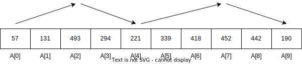

# 힙

힙(heap)은 특별한 이진 트리이다. 우선순위 큐(priority queue)도 마찬가지다. 힙은 9장 앞 부분에서 설명했듯이 완전 이진 트리이며, 각 노드의 키값은 자식의 키값보다 크거나 같아야 한다는 힙의 속성을 반드시 만족해야 한다. 그림 10.1(a)에 최대힙(max-heap)의 예제가 나와 있다. 최대힙은 배열로 구현할 수 있는데, i번째 노드의 자식 노드를 2i + 1과 2i + 2번째 위치에 배열하면 된다. 그림 10.1(a)에 나와 있는 최대힙을 배열로 구현하면 <561, 314, 401, 28, 156, 359, 271, 11, 3>이 된다.


(왼쪽의 힙에서 최댓값을 삭제했다. 삭제 연산은 루트의 키값과 마지막 단말 노드의 키값을 교환한 뒤 힙의 속성이 만족되도록 루트를 자식노드와 반복적으로 교환해 나가는 방식으로 구현할 수 있다.)

최대힙에서 삽입 연산은 $O(log n)$, 최댓값을 찾는 연산은 $O(1)$, 최댓값을 삭제하는 연산은 $O(log n)$이 된다. extract-max 연산은 최댓값을 반환함과 동시에 삭제하는 연산을 의미한다. 그림 10.1(b)에 최댓값을 삭제하는 예제가 나와 있다. 임의의 키값을 탐색하는 연산의 시간 복잡도는 $O(n)$이 된다.

최소힙(min-heap)은 최대힙의 정반대 버전의 자료구조이고, 최솟값을 찾는 연산의 시간 복잡도가 $O(1)$이다.

## 힙 부트캠프

문자열이 '스트리밍' 방식으로 들어온다고 가정하자. 앞에서 입력된 문자열은 뒤로 돌아가서 읽을 수가 없다는 뜻이다. 이때 길이가 k번째로 긴 문자열을 찾는 프로그램을 작성해 보자. 문자열 길이를 모두 알아야 하는 게 아니므로 입력된 문자열을 순서대로 재배치하지 않아도 된다.

입력을 처리함과 동시에 현재까지 문자열 중에서 k번째로 긴 문자열이 무엇인지 추적하려고 한다. 현재 k개의 문자열이 있다고 가정해 보자. 길이가 더 긴 문자열이 입력으로 들어온다면 길이가 가장 작은 문자열을 지워야 한다. 최소힙(최대힙이 아니다!) 자료구조를 사용하면 최솟값 찾는 연산, 최솟값 삭제하는 연산, 삽입 연산을 효율적으로 할 수 있기 때문에 이 문제를 푸는 데 적합하다. 다음 코드는 길이에 따라 문자열에 순서를 매길 수 있는 비교 함수가 포함된 힙을 구현했다.

```java
public static List<String> topK(int k, Iterator<String> iter) {
    PriorityQueue<String> minHeap = new PriorityQueue<>(k, new Comparator<String>() {
        public int compare(String s1, String s2) {
            return Integer.compare(s1.length(), s2.length());
        }
    });

    while (iter.hasNext()) {
        if (minHeap.size() > k) {
            // 길이가 가장 작은 문자열을 삭제한다.
            // 앞의 비교 함수를 통해 문자열을 길이 순서대로 나열할 수 있음을 기억하라.
            minHeap.poll();
        }
    }
    return new ArrayList<>(minHeap);
}
```

각 문자열을 처리하려면 해당 문자열을 힙에 삽입하고 최소 원소를 삭제해야 하므로 총 $O(log k)$ 시간이 걸린다. 따라서 n개의 문자열이 입력으로 주어진다면, 총 시간 복잡도는 $O(n log k)$가 된다.

최선의 경우에는 시간 복잡도가 개선된다. 만약 입력된 새로운 문자열의 길이가 힙의 맨 위 문자열(이 문자열을 얻는 데 $O(1)$의 시간이 걸린다)의 길이보다 작다면 삽입 연산을 건너뛸 수 있기 때문이다.

## 힙 문제를 풀기 전 꼭 알고 있어야 할 내용

- `최대 혹은 최소 원소만이 중요`하고, `임의의 원소를 빠르게 읽거나 삭제하거나 탐색할 필요가 없다면` 힙을 사용하라.[문제 10.1]
- 컬렉션에서 `k번째로 큰 원소 혹은 k번째로 작은 원소`를 찾고자 한다면 힙은 좋은 자료구조가 될 수 있다. k번째로 큰 원소를 찾으려면 최소힙을 사용하고, k번째로 작은 원소를 찾으려면 최대힙을 사용하라.[문제 10.4]

## 힙 라이브러리 이해하기

Java의 컬렉션 프레임워크를 사용해서 구현한 힙은 PriorityQueue라는 우선순위 큐 클래스이다. 핵심 메서드는 add("Gauss"), peek(), poll()이다. 힙이 비어 있는 경우에 peek()과 poll()은 수행하면 null을 반환한다. 앞에서 언급했듯이 힙의 생성자에 임의의 비교 연산자(comparator)를 구현할 수 있다.

## 문제 10.1 정렬된 파일 합치기

여러분에게 500개의 파일이 주어져 있다. 이 파일에는 S&P 500회사의 주식 거래 정보가 들어 있다. 각 거래 정보는 한 줄에 1232111, AAPL, 30, 456.12의 형태로 작성되어 있다.

첫 번째 숫자(1232111)는 그날 거래를 시작한 이후 걸린 시간을 밀리세컨드(ms)로 표현한 값이다. 각 파일의 각 줄은 시간 순서대로 정렬되어 있다. 여러분은 500개의 파일에 나와 있는 거래 정보를 시간 순서대로 정렬해서 하나의 파일로 작성하려고 한다. 각 파일의 크기는 대략 5GB이다.

내용을 간단히 하기 위해 조금 더 추상적인 형태로 문제를 제시하겠다.

정렬된 시퀀스의 집합이 주어졌을 때, 이들을 하나의 정렬된 시퀀스로 합치는 프로그램을 작성하라. 예를 들어 <3, 5, 7>, <0, 6>, <0, 6, 28>이 입력으로 주어진다면, 결과면 <0, 0, 3, 5 ,6, 6, 7, 28>이 된다.

> 힌트: 각 시퀀스의 어떤 부분이 알고리즘을 수행하는 데 중요한 역할을 하는가?

무식한 방법을 사용하면 이들 시퀀스를 하나의 배열에 합친 뒤 정렬하면 된다. 전체 원소의 개수가 n개일 때 이 방법의 시간 복잡도는 $O(n log n)$이 된다.

하지만 이 방법은 각각의 시퀀스가 정렬되어 있다는 사실을 이용하지 않았다. 따라서 이 특성을 활용하면, 각 시퀀스에서 첫 번째 원소를 뽑아낸 뒤 이들 중에서 가장 작은 원소를 골라내는 과정을 반복하면 된다.

임의의 원소를 삽입하고 최솟값을 뽑아낼 수 있는 원소의 컬렉션을 유지하고 싶을 때는 최소힙이 적당하다.

여기서는 설명을 쉽게 하기 위해 파일 대신 배열을 이용한다. 3개의 정렬된 배열, <3, 5, 7>, <0, 6>, <0, 6, 28>이 있을 때 이들을 합치는 과정을 살펴보자. 실제로는 해당 원소가 어떤 배열의 어느 위치에 있었는지에 대한 추가 정보가 필요하다. (파일을 대상으로 할 경우에는 각 시퀀스에서 처리되지 않은 원소의 인덱스를 알고 있을 필요가 없다. 왜냐하면 다음에 읽어야 할 위치는 파일 I/O 라이브러리가 알고 있기 때문이다.)

최소힙은 각 배열의 첫 번째 원소로 초기화한다. 즉, {3, 0, 0}이 된다. 가장 작은 원소인 0을 뽑아낸 뒤 이를 결과 리스트에 추가하면 <0>이 된다. 그다음 6을 최소힙에 추가하면 {3, 0, 6}이 된다. (세 번째 배열에 있던 0 원소를 뽑았다고 가정했지만, 두 번째 배열을 선택해도 상관 없다.) 그다음 0을 뽑아낸 뒤 이를 결과에 추가하면 <0, 0>이 된다. 그다음 6을 최소힙에 추가하면 {3, 6, 6}이 된다. 그다음 3을 뽑아내고 이를 결과에 추가하면 <0, 0, 3>이 된다. 그다음 5를 최소힙에 추가하면 {5, 6, 6}이 된다. 그다음 5를 뽑아내고 이를 결과에 추가하면 <0, 0, 3, 5>가 된다. 그다음 7을 최소힙에 추가하면 {7, 6, 6}이 된다. 그다음 6을 뽑아서 결과에 추가하면 <0, 0, 3, 5, 6>이 된다. 6은 두 번째 배열에서 선택했다고 가정하자. 이제 두 번째 배열에 남아 있는 원소는 없으므로 최소힙은 {7,6}이 된다. 그다음 6을 뽑아서 결과에 추가하면 <0, 0, 3, 5, 6, 6>이 된다. 그다음 28을 최소힙에 추가하면 {7, 28}이 된다. 그다음 7을 뽑아서 결과에 추가하면 <0, 0, 3, 5, 6, 6, 7>이 된다. 최소힙은 {28}이 된다. 그다음 28을 뽑아서 결과에 추가하면 <0, 0, 3, 5, 6, 6, 7, 28>이 된다. 이제 모든 원소를 다 처리했고 결과 리스트에는 모든 원소가 정렬된 상태로 저장되어 있다.

```java
private static class ArrayEntry {
    public Integer value;
    public Integer arrayId;

    public ArrayEntry(Integer value, Integer arrayId) {
        this.value = value;
        this.arrayId = arrayId;
    }
}

public static List<Integer> mergeSortedArrays( List<List<Integer>> sortedArrays ) {
    List<Iterator<Integer>> iters = new ArrayList<>(sortedArrays.size());
    for (List<Integer> array : sortedArrays) {
        iters.add(array.iterator());
    }
    PriorityQueue<ArrayEntry> minHeap = new PriorityQueue<>(
        ((int)sortedArray.size()),
        new Comparator<ArrayEntry>() {
            @Override
            public int compare(ArrayEntry o1, ArrayEntry o2) {
                return Integer.compare(o1.value, o2.value);
            }
        }
    );
    for (int i = 0; i < iter.size(); i++) {
        if (iters.get(i).hasNext()) {
            minHeap.add(new ArrayEntry(iters.get(i).next(), i));
        }
    }

    List<Integer> result = new ArrayList<>();
    while (!minHeap.isEmpty()) {
        ArrayEntry headEntry = minHeap.poll();
        result.add(headEntry.value);
        if (iters.get(headEntry.arrayId).hasNext()) {
            minHeap.add(new ArrayEntry(iters.get(headEntry.arrayId).next(), headEntry.arrayId));
        }
    }
    return result;
}
```

k가 입력으로 주어진 시퀀스의 개수라고 하자. 최소힙에는 k보다 많은 원소가 들어 있을 수 없다. extract-min 연산과 insert 연산은 모두 $O(log k)$ 시간이 걸린다. 따라서 합치는 작업은 $O(n log k)$ 시간에 수행할 수 있다. 최종 결과를 쓸 때 필요한 공간을 제외하고서 $O(k)$의 공간 복잡도가 필요하다. 만약에 배열이 아닌 파일에서 읽고 파일에서 쓴다면, 추가로 $O(k)$ 공간만 필요할 것이다.

한번에 두 개씩 병합 정렬(merge sort)을 사용해서 k개의 파일을 재귀적으로 합칠 수도 있다. 그러면 파일의 개수가 k, k/2, k/4의 방식으로 줄어들 것이다. 총 log k번 반복하게 되고, 매번 $O(n)$의 시간 복잡도가 소요될 것이므로 전체 시간 복잡도는 힙을 사용했을 때와 마찬가지로 $O(n log k)$가 된다. 공간 복잡도는 합리적인 방법으로 병합 정렬을 구현했을 때와 마찬가지로 $O(n)$이 된다. $k << n$일 때 힙을 사용했을 때의 공간 복잡도인 $O(k)$보다 상당히 크다.

## 문제 10.2 증가했다가 감소하는 배열 정렬하기

배열의 원소가 특정 인덱스까지 증가했다가 감소하고 다시 증가하는 과정이 k번 반복된다면 이 배열을 k-증가-감소라고 한다. 그림 10.2에 자세히 나와 있다.



k-증가-감소 배열을 정렬하는 효율적인 알고리즘을 설계하라.

> 이 문제를 k개의 정렬된 배열을 합치는 문제로 바꿀 수 있을까?

무식한 방법을 써 보자. k-증가-감소의 특성, 즉 배열의 원소들이 내림차순 또는 오름차순으로 부분적이나마 정렬되어 있다는 사실을 무시한 채 배열을 정렬한다. 배열의 길이가 n일 때 정렬의 시간 복잡도는 $O(n log n)$이 된다.

만약 k가 n보다 굉장히 작다면 개선할 여지가 있다. k가 2라고 가정해 보자. 입력 배열은 증가하는 부분배열과 감소하는 부분배열, 이렇게 두 개의 부분 배열로 이루어져 있다. 따라서 두 번째 부분배열을 뒤집어 두 개의 정렬된 배열을 만든 뒤 이 둘을 합쳐주면 된다. 두 개의 정렬된 배열을 하나로 합치는 작업은 간단하게 $O(n)$ 시간에 할 수 있다.

따라서 일반화하면 감소하는 부분배열의 순서를 뒤집으면 된다. 그림 10.2를 보면 A를 <57, 131, 493>, <221, 294>, <339, 418, 452>, <190, 442> 이렇게 네 개의 정렬된 배열로 구분할 수 있다. 이제 문제 10.1의 해법을 사용해서 이들을 합치면 된다.

```java
public static List<Integer> sortKIncreasingDecreasingArrayArray(List<Integer> A) {
    // A를 정렬된 배열의 집합으로 구분한다.
    List<List<Integer>> sortedSubarrays = new ArrayList<>();
    SubarrayType subarrayType = SubarrayType.INCREASING;
    int startIdx = 0;
    for (int i = 0; i <= A.size(); ++i) {
        if ( i == A.size() // A가 끝났다. 마지막 부분배열을 추가한다.
            || (A.get(i - 1) < A.get(i) && subarrayType == SubarrayType.DECREASING)
            || (A.get(i - 1) >= A.get(i) && subarrayType == SubarrayType.INCREASING)
         ) { 
            List<Integer> subList = A.subList(startIdx, i);
            if (subarrayType == SubarrayType.DECREASING) {
                Collections.reverse(subList);
            }
            sortedArrays.add(subList);
            startIdx = i;
            subarrayType = (subarrayType == SubarrayType.INCREASING
                            ? SubarrayType.DECREASING
                            : SubarrayType.INCREASING)
        }
    }
    return MergeSortedArrays.mergeSortedArrays(sortedSubarrays);
}

private static enum SubarrayType { INCREASING, DECREASING }
```

문제 10.1의 해법과 같이 시간 복잡도는 $O(n log k)$가 된다.

## 문제 10.3 거의 정렬된 배열 정렬하기

완벽하지는 않지만 대부분 정렬된 상태의 데이터를 다루는 경우가 종종 있다. 예를 들어 서버에 시간 정보가 찍힌 주식 자료가 들어오는 경우에 서버의 부하 정도와 네트워크의 이동 경로에 따라서 시간순으로 이전 주식 자료가 다른 자료보다 살짝 늦게 들어올 수 있다. 여기서는 이러한 데이터를 효율적으로 정렬하는 문제를 다룰 것이다.

굉장히 길이가 긴 수열이 입력으로 주어졌을 때 이를 정렬된 순서대로 출력하는 프로그램을 작성하라. 각 숫자의 위치는 정렬되었을 때의 위치보다 최대 k만큼 떨어져 있다(이런 배열을 k-정렬된 배열이라 한다). 예를 들어 <3, -1, 2, 6, 4, 5, 8>은 최종 정렬된 숫자 위치보다 최대 2만큼 떨어져 있다.

> 힌트: i번째 숫자를 읽은 후에 몇 개나 더 읽어야 해당 숫자를 올바른 위치에 놓을 수 있을까?

무식한 방법은 주어진 수열을 배열에 넣은 후에 정렬하고 그 결과를 출력하는 것이다. 입력의 길이가 n일 때 이 방법의 시간 복잡도는 $O(n log n)$이고 공간 복잡도는 $O(n)$이다.

하지만 거의 정렬되었다는 이점을 사용하면 복잡도를 더 개선할 수 있다. 즉, k + 1개의 숫자 중에서 가장 작은 숫자는 이후의 모든 숫자보다 반드시 작아야 한다. 주어진 예제에서 첫 숫자 세 개 3, -1, 2에서 가장 작은 숫자인 -1은 전체 숫자에서 가장 작은 숫자여야만 한다. 왜냐하면 입력으로 주어진 모든 숫자가 최종 정렬된 위치에서 최대 2만큼 떨어져 있다는 속성을 가지고 있고 정렬된 수열에서 가장 작은 숫자는 0번 인덱스에 위치해 있기 때문이다. 4를 읽은 후에는 3,2,4 중에서 가장 작은 숫자인 2가 두 번째로 작은 숫자가 된다.

이를 일반화해 보자. 우리는 k + 1개의 숫자를 저장하고, 그중에서 최솟값을 찾는 작업과 새로운 값을 추가하는 작업을 효율적으로 할 수 있는 자료구조가 필요하다. 따라서 이를 수행하는데 가장 적합한 자료구조는 최소힙일 것이다. 첫 번째 k개의 숫자를 최소힙에 추가한다. 그리고 다음 숫자를 최소힙에 추가한 뒤 최솟값을 찾는다.(숫자를 모두 소진해 버렸다면 최솟값을 찾는 작업만 수행하면 된다.)

```java
public static List<Integer> sortApproximatelySortedData(Iterator<Integer> sequence, int k) {
    List<Integer> result = new ArrayList<>();
    PriorityQueue<Integer> minHeap = new PriorityQueue<>();
    // 첫 k개의 원소를 minHeap에 추가한다.
    // 만약 k개보다 적은 원소가 들어 있다면 멈춘다.
    for (int i = 0; i < k && sequence.hasNext(); ++i) {
        minHeap.add(sequence.next());
    }

    // 새로운 원소가 들어오면, minHeap에 추가한 뒤 최솟값을 뽑아낸다.
    while (sequence.hasNext()) {
        minHeap.add(sequence.next());
        Integer smallest = minHeap.remove();
        result.add(smallest);
    }
    
    // 원소를 모두 읽었다면, 반복적으로 남아 있는 원소를 뽑아낸다.
    while(!minHeap.isEmpty()) {
        Integer smallest = minHeap.remove();
        result.add(smallest);
    }
    return result;
}
```

시간 복잡도는 $O(n log k)$이고, 공간 복잡도는 $O(k)$이다.

## 문제 10.4 k개의 가까운 별 찾기

지구가 (0, 0, 0)의 위치에 있는 은하계를 상상해 보자. 별은 점으로 표현하고 거리는 광년(light year)으로 나타낸다고 가정하자. 은하계에는 대략 $10^12$개의 별이 존재하고 별들의 위치가 파일에 저장되어 있다고 하자.

지구와 가장 가까운 별 k개를 찾으려면 어떻게 해야 할까?

> 힌트: n개의 별 중에서 가장 가까운 별 k개를 알고 있다고 가정하자. 만약 n + 1번 째 별이 가까운 k개의 별 집합에 추가되었을 때 어떤 원소를 빼내야 할까?

만약 램(RAM)의 크기에 제한이 없다면 모든 자료를 배열에 넣은 다음, 정렬을 해서 k개의 원소를 찾으면 된다. 혹은 문제 11.8의 해법을 사용해서 k번째 작은 원소를 찾은 뒤, 간단하게 k개의 작은 원소를 찾으면 된다. 두 경우 모두 $O(n)$의 공간 복잡도를 사용하며, 데이터의 개수가 굉장히 많은 경우에는 램에 모두 저장할 수 없다는 문제가 있다.

직관적으로 생각해 보면 지구와 가까이 위치한 별에만 집중하면 된다. 즉, 별의 위치에 따라 반복적으로 후보 집합을 갱신하고, 필요한 후보 집합을 유지하면 된다. 여기서 후보 집합이란 지금까지의 별들 중에서 가장 가까운 별 k개를 의미한다. 새로운 별이 입력으로 들어왔을 때 이 별을 후보 집합에 넣어도 되는지 확인한다. 이 작업은 후보 집합에 있는 별 중에서 지구와 가장 멀리 떨어진 별과 비교해 보면 된다. 이 별을 찾기 위해선 효과적으로 최고값을 찾을 수 있고, 새로운 원소를 삽입할 수 있는 자료구조가 필요하다.

이 애플리케이션에 완벽한 자료구조는 최대힙이다. 먼저 첫 k개의 별을 최대힙에 삽입한다. 그 뒤 새로운 별을 하나씩 살펴보면서, 최대힙에 들어 있는 별 중에서 가장 거리가 먼 별보다 현재 별의 거리가 더 가깝다면 최대힙에서 원소를 하나 제거하고 새로운 원소를 삽입한다. 만약 그렇지 않다면 다음 별로 넘어간다. 아래의 코드는 각각의 별을 최대힙에 추가한 뒤에 k + 1번째 원소가 삽입된 순간부터 원소를 하나씩 제거했다.

```java
public static class Star implements Comparable<Star> {
    private double x, y, z;

    public Star(double x, double y, double z) {
        this.x = x;
        this.y = y;
        this.z = z;
    }

    public double distance() { return Math.sqrt(x * x + y * y + z * z); }

    @Override
    public int compareTo(Star rhs) {
        return Double.compare(this.distance(), rhs.distance());
    }
}

public static List<Star> findCloserKStars(Iterator<Star> stars, int k) {
    // 현재까지 중에서 가장 가까운 별 k개를 저장할 maxHeap
    PriorityQueue<Star> maxHeap = new PriorityQueue<>(k, Collections.reserveOrder());
    while (stars.hasNext()) {
        // 각각의 별을 최대힙에 추가한다. 만약 최대힙의 크기가 k보다 커진다면,
        // 최대힙에서 최대 원소를 삭제한다.
        Star star = stars.next();
        maxHeap.add(star);
        if (maxHeap.size() == k + 1) {
            maxHeap.remove();
        }
    }

    List<Star> orderedStars = new ArrayList<Star>(maxHeap);
    // PriorityQueue는 최대 원소가 가장 앞에 온다는 사실을 보장해 줄 뿐
    // 나머지 원소들의 순서는 보장이 안 되므로, orderedStars를 정렬한다.
    Collections.sort(orderedStars);
    return orderedStars;
}

/*
가장 가까운 k개를 찾는다고 단순히 최소힙을 쓸 수가 없다.
n개를 모두 공간에 넣을 수 없는 경우가 있을뿐더러
구해야하는 최소값외의 값들(k-1개의 나머지 최소값들)을 구할 수 없다.
그래서 최대힙(Collections.reverseOrder() 파라미터로 값들을 역으로 입력함)으로 k개를 구한다.
*/
```

시간 복잡도는 $O(n log k)$이고, 공간 복잡도는 $O(k)$이다.

## 문제 10.5 실시간으로 주어진 데이터의 중앙값 찾기

어떤 시퀀스가 스트리밍으로 들어오는데 실시간으로 중앙값을 계산하려고 한다. 스트리밍이므로 이전 값을 어딘가에 저장해 놓고 읽을 수 없다. 따라서 새로운 원소를 읽을 때마다 중앙값을 출력해야 한다. 예를 들어 입력이 1, 0, 3, 5, 2, 0, 1이라면 출력은 1, 0.5, 1, 2, 2, 1.5, 1이 된다.

어떤 시퀀스의 중앙값을 실시간으로 찾아주는 알고리즘을 설계해 보라.

> 힌트: 새로운 값을 읽었을 때 이전의 모든 값은 읽지 않아도 된다.

무식한 방법은 문제 11.8의 해법과 같다. 현재까지의 모든 원소들을 배열에 저장한 뒤 k번째 원소를 찾는 방법으로 중앙값을 계산하면 된다. n개의 원소가 스트리밍으로 주어진다면 이 방법의 시간 복잡도는 $O(n^2)$이 된다.

이 방법은 계산해 둔 값을 재사용하지 않고 매번 다시 계산하는 단점이 있다. 어떤 집단의 중앙값은 이 집단을 두 개의 동일한 부분 집단으로 나눈다. 즉, 중앙값보다 작은 집단과 중앙값과 같거나 큰 집단으로 나눈다. 여기에 새로운 원소가 들어오면, 부분 집단 입자에서는 최대 하나의 원소만 바뀐다. 또한 어떤 부분 집단에서 다른 부분 집단으로 원소를 옮겨야 할 수도 있다. 작은 부분 집단에서 가장 큰 원소이거나 큰 부분 집단에서 가장 작은 원소를 옮기게 된다.

여기서 작은 부분 집단을 위한 최대힙과 큰 부분 집단을 위한 최소힙, 이렇게 두 개의 힙을 사용할 것이다. 그리고 이 둘의 크기가 균형이 맞도록 유지할 것이다. 최대힙은 작은 부분 집단에서 가장 큰 원소를 효과적으로 빼낼 수 있다는 장점이 있고, 최소힙도 이와 비슷한 장점이 있다.

예를 들어 입력이 1, 0, 3, 5, 2, 0, 1이고, L과 H가 각각 최소힙과 최대힙이라고 하자. 중앙값을 찾는 과정은 다음과 같다.

1. 1을 읽음: L = [1], H = [], 중앙값은 1
2. 0을 읽음: L = [1], H = [0], 중앙값은 (1+0)/2 = 0.5
3. 3을 읽음: L = [1, 3], H = [0], 중앙값은 1
4. 5를 읽음: L = [3, 5], H = [1, 0], 중앙값은 (3+1)/2 = 2
5. 2를 읽음: L = [2, 3, 5], H = [1, 0], 중앙값은 2
6. 0을 읽음: L = [2, 3, 5], H = [1, 0, 0], 중앙값은 (2+1)/2 = 1.5
7. 1을 읽음: L = [1, 2, 3, 5], H = [1, 0, 0], 중앙값은 1

```java
private static final int DEFAULT_INITIAL_CAPACITY = 16;

public static List<Double> onlineMedian(Iterator<Integer> sequence) {
    // minHeap은 현재까지의 값이 큰 절반을 저장한다.
    PriorityQueue<Integer> minHeap = new PriorityQueue<>();
    // maxHeap은 현재까지의 값이 작은 절반을 저장한다.
    PriorityQueue<Integer> maxHeap = new PriorityQueue<>(
        DEFAULT_INITIAL_CAPACITY, Collections.reverseOrder()
    );
    List<Double> result = new ArrayList<>();

    while (sequence.hasNext()) {
        int x = sequence.next();
        minHeap.add(x);
        maxHeap.add(minHeap.remove());
        // 짝수 개의 원소를 읽었다면 minHeap과 maxHeap에는 동일한 개수의 원소가
        // 들어 있어야 한다. 홀수 개의 원소를 읽었다면, minHeap이 언제나 maxHeap보다
        // 원소 한 개를 더 많이 가지고 있어야 한다.
        if (maxHeap.size() > minHeap.size()) {
            minHeap.add(maxHeap.remove());
        }

        result.add((minHeap.size() == maxHeap.size()
                    ? 0.5 * (minHeap.peek() + maxHeap.peek())
                    : (double)minHeap.peek()));
    }
    return result;
}
```

매 원소마다 $O(log n)$의 시간이 걸린다. 이는 힙에 원소를 삽입하거나 빼내는 시간 복잡도와 비슷한다.

