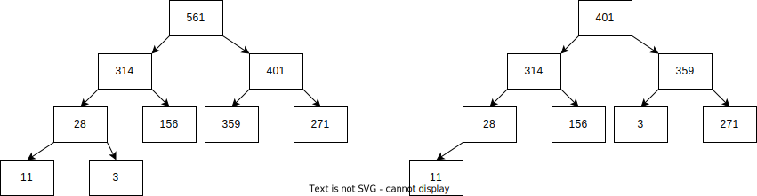

# 힙

힙(heap)은 특별한 이진 트리이다. 우선순위 큐(priority queue)도 마찬가지다. 힙은 9장 앞 부분에서 설명했듯이 완전 이진 트리이며, 각 노드의 키값은 자식의 키값보다 크거나 같아야 한다는 힙의 속성을 반드시 만족해야 한다. 그림 10.1(a)에 최대힙(max-heap)의 예제가 나와 있다. 최대힙은 배열로 구현할 수 있는데, i번째 노드의 자식 노드를 2i + 1과 2i + 2번째 위치에 배열하면 된다. 그림 10.1(a)에 나와 있는 최대힙을 배열로 구현하면 <561, 314, 401, 28, 156, 359, 271, 11, 3>이 된다.



(왼쪽의 힙에서 최댓값을 삭제했다. 삭제 연산은 루트의 키값과 마지막 단말 노드의 키값을 교환한 뒤 힙의 속성이 만족되도록 루트를 자식노드와 반복적으로 교환해 나가는 방식으로 구현할 수 있다.)

최대힙에서 삽입 연산은 $O(log n)$, 최댓값을 찾는 연산은 $O(1)$, 최댓값을 삭제하는 연산은 $O(log n)$이 된다. extract-max 연산은 최댓값을 반환함과 동시에 삭제하는 연산을 의미한다. 그림 10.1(b)에 최댓값을 삭제하는 예제가 나와 있다. 임의의 키값을 탐색하는 연산의 시간 복잡도는 $O(n)$이 된다.

최소힙(min-heap)은 최대힙의 정반대 버전의 자료구조이고, 최솟값을 찾는 연산의 시간 복잡도가 $O(1)$이다.

## 힙 부트캠프

문자열이 '스트리밍' 방식으로 들어온다고 가정하자. 앞에서 입력된 문자열은 뒤로 돌아가서 읽을 수가 없다는 뜻이다. 이때 길이가 k번째로 긴 문자열을 찾는 프로그램을 작성해 보자. 문자열 길이를 모두 알아야 하는 게 아니므로 입력된 문자열을 순서대로 재배치하지 않아도 된다.

입력을 처리함과 동시에 현재까지 문자열 중에서 k번째로 긴 문자열이 무엇인지 추적하려고 한다. 현재 k개의 문자열이 있다고 가정해 보자. 길이가 더 긴 문자열이 입력으로 들어온다면 길이가 가장 작은 문자열을 지워야 한다. 최소힙(최대힙이 아니다!) 자료구조를 사용하면 최솟값 찾는 연산, 최솟값 삭제하는 연산, 삽입 연산을 효율적으로 할 수 있기 때문에 이 문제를 푸는 데 적합하다. 다음 코드는 길이에 따라 문자열에 순서를 매길 수 있는 비교 함수가 포함된 힙을 구현했다.

```java
public static List<String> topK(int k, Iterator<String> iter) {
    PriorityQueue<String> minHeap = new PriorityQueue<>(k, new Comparator<String>() {
        public int compare(String s1, String s2) {
            return Integer.compare(s1.length(), s2.length());
        }
    });

    while (iter.hasNext()) {
        if (minHeap.size() > k) {
            // 길이가 가장 작은 문자열을 삭제한다.
            // 앞의 비교 함수를 통해 문자열을 길이 순서대로 나열할 수 있음을 기억하라.
            minHeap.poll();
        }
    }
    return new ArrayList<>(minHeap);
}
```

각 문자열을 처리하려면 해당 문자열을 힙에 삽입하고 최소 원소를 삭제해야 하므로 총 $O(log k)$ 시간이 걸린다. 따라서 n개의 문자열이 입력으로 주어진다면, 총 시간 복잡도는 $O(n log k)$가 된다.

최선의 경우에는 시간 복잡도가 개선된다. 만약 입력된 새로운 문자열의 길이가 힙의 맨 위 문자열(이 문자열을 얻는 데 $O(1)$의 시간이 걸린다)의 길이보다 작다면 삽입 연산을 건너뛸 수 있기 때문이다.

## 힙 문제를 풀기 전 꼭 알고 있어야 할 내용

- `최대 혹은 최소 원소만이 중요`하고, `임의의 원소를 빠르게 읽거나 삭제하거나 탐색할 필요가 없다면` 힙을 사용하라.[문제 10.1]
- 컬렉션에서 `k번째로 큰 원소 혹은 k번째로 작은 원소`를 찾고자 한다면 힙은 좋은 자료구조가 될 수 있다. k번째로 큰 원소를 찾으려면 최소힙을 사용하고, k번째로 작은 원소를 찾으려면 최대힙을 사용하라.[문제 10.4]

## 힙 라이브러리 이해하기

Java의 컬렉션 프레임워크를 사용해서 구현한 힙은 PriorityQueue라는 우선순위 큐 클래스이다. 핵심 메서드는 add("Gauss"), peek(), poll()이다. 힙이 비어 있는 경우에 peek()과 poll()은 수행하면 null을 반환한다. 앞에서 언급했듯이 힙의 생성자에 임의의 비교 연산자(comparator)를 구현할 수 있다.

