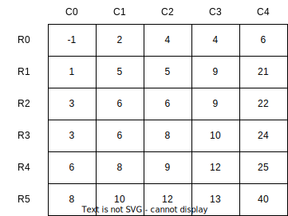

# 11장 탐색

탐색 알고리즘은 다음과 같은 여러 가지 방법으로 분류할 수 있다. 탐색해야 할 컬렉션이 정적인가 동적인가? 예를 들어 삽입과 삭제가 탐색과 함께 수행되는가? 데이터 처리하는 비용을 사전에 사용하고 후속 쿼리에 빠르게 대처할 필요가 있는가? 우리가 이용할 수 있는 데이터의 통계적 속성이 존재하는가? 데이터를 그대로 사용할 것인가 아니면 변환할 것인가?

이번 장에서는 배열의 데이터가 정렬되어 있는 경우에 초점을 맞출 것이다. 동적인 상황에 적합한 자료구조는 10장, 12장, 14장에 나와 있다.

이번 장에서는 이진 탐색과 관련된 문제들을 만나 본다. 두 번째로 만날 문제들은 일반적인 탐색과 관련이 있다.

## 이진 탐색

임의의 키가 n개 주어졌을 때, 어떤 키를 탐색하는 방법은 모든 원소를 살펴보는 것밖에 없다. 이 방법의 시간 복잡도는 $O(n)$이다. 근복적으로 이진 탐색은 정렬된 배열에서 탐색을 해나갈 때 필요 없는 부분을 없애 나가는 전략을 사용한다. 키를 정렬된 상태로 유지하면서 탐색하지 않아도 될 절반의 키를 없애 나가는 방법이다. 만약 탐색하고자 할 키가 배열의 중간 원소와 같지 않다면, 중간 원소를 기준으로 왼쪽 혹은 오른쪽 원소들은 탐색하지 않아도 된다.

이진 탐색과 관련된 질문은 면접관 입장에서 꽤 매력적이다. 왜냐하면 이진 탐색은 실력 있는 지원자들이 알고 있어야 할 기본적인 기술임과 동시에 몇 줄 안에 구현을 할 수 있는 알고리즘이기 때문이다. 게다가 이진 탐색은 올바르게 구현하기 생각보다 까다롭다. 따라서 이진 탐색을 구현하면서 코너 케이스에 대한 테스트도 함께 작성하는 것이 좋다. 그래야 자신이 이진 탐색을 제대로 이해하고 있는지 확실히 알 수 있다.

공개된 구현 방법 중에서도 이진 트리가 미묘하게 잘못 구현된 것들이 종종 있다. 20권의 책 중에서 5권만이 이진 트리를 제대로 구현했다는 조사 결과도 있다.

<생각하는 프로그래밍>의 저자 존 벤틀리(Jon Bentley)는 전문 프로그래머를 대상으로 수업을 진행한 적이 있는데, 시간이 충분했음에도 불구하고 90%의 코드가 제대로 구현되지 않았다는 걸 발견하기도 했다.

이진 탐색은 재귀, 반복, 조건에 따른 관용구 등 여러 방법으로 작성할 수 있다. 다음은 벤틀리의 책에서 가져온, 반복으로 구현된 이진 탐색 코드다. 여기에는 버그가 있다.

```java
public static int bsearch(int t, List<Integer> A) {
    int L = 0, U = A.size() - 1;
    while (L <= U) {
        int M = (L + U) / 2; // M = L + (U - L) / 2가 되어야 함
        if (A.get(M) < t) {
            L = M + 1;
        } else if (A.get(M) == t) {
            return M;
        } else {
            U = M - 1;
        }
    }
    return -1;
}
```

여기서 잘못된 부분은 4번째 줄이다. M = (L + U) / 2에서 잠재적인 오버플로가 발생할 수 있다. 이 오버플로는 식을 M = L + (U - L) / 2로 수정하면 피할 수 있다.

이진 탐색의 시간 복잡도는 $T(n) = T(n/2) + c$이다. 여기서 c는 상수항이다. 이 수식을 풀면 $T(n) = O(log n)$이 되는데, 이는 키가 정렬되어 있지 않았을 때의 $O(n)$ 방법보다 훨씬 빠르다. 이진 탐색은 배열이 정렬되어 있어야 한다는 단점이 있다. 정렬에 $O(n log n)$ 시간이 걸린다. 하지만 탐색 횟수가 많을 경우, 정렬에 걸리는 시간은 큰 문제가 되지 않을 수도 있다.

정렬된 배열에서 탐색하는 문제를 다룰 경우 좀 더 주의 깊게 생각해야 하며, 코너 케이스를 누락시키지 않도록 유의해야 한다.

## 탐색 부트캠프

객체끼리 비교할 수 있다면 정렬할 수 있고, 탐색 라이브러리를 이용할 수 있다. 일반적으로 대부분의 언어는 정수(Integer), 문자열(String), 날짜 클래스, URL, SQL 타임스탬프 등과 같은 내장형 변수를 어떻게 비교해야 하는지 알고 있다. 하지만 사용자가 직접 정의한 자료형이라면, 사용자가 명시적으로 비교 함수를 작성해야 한다. 또한 이 비교 함수는 이행성(transitivity)을 만족해야 한다. (만약 비교 함수가 올바르게 구현되어 있지 않다면, 정렬된 컬렉션에 해당 아이템이 존재하더라도 찾지 못하는 경우가 발생할 수 있다.)

학생 정보고 이루어진 배열이 입력으로 주어지고, 이 배열은 GPA가 감소하는 순서대로 정렬되어 있다고 가정하자. GPA가 같다면 이름순으로 정렬된다. 다음 프로그램은 이진 탐색 라이브러리를 통해 배열을 빠르게 탐색한다. 특히, 학생의 GPA를 통한 맞춤형 비교 함수(높은 GPA가 먼저 오도록)를 이진 탐색 라이브러리에서 비교하는 데 사용했다.

```java
public static class Student {
    public String name;
    public double gradePointAverage;

    Student(String name, Integer gradePointAverage) {
        this. name = name;
        this.gradePointAverage = gradePointAverage;
    }
}

private static final Comparator<Student> compGPA = new Comparator<Student>() {
    @Override
    public int compare(Student a, Student b) {
        if (a.gradePointAverage != b.gradePointAverage) {
            return Double.compare(a.gradePointAverage, b.gradePointAverage);
        }
        return a.name.compareTo(b.name);
    }
};

public static boolean searchStudent(List<Student> students, Student target, Comparator<Student> compGPA) {
    return Collections.binarySearch(students, target, compGPA);
}
```

i번째 원소를 접근하는데 $O(1)$시간이 걸린다면, 이 프로그램의 시간 복잡도는 $O(log n)$이 된다.

## 탐색 문제를 풀기 전 꼭 알고 있어야 할 내용

- `이진 탐색`은 효과적인 탐색 도구이다. 단지 `정렬된 배열`에서 탐색하는 것보다 더 많은 곳에서 응용 가능하다. 예를 들어 `정수 혹은 실수의 구간`을 탐색할 때 사용될 수도 있다. [문제 11.4]
- 만약 여러분의 해법에서 정렬을 사용하고, 그 후에 수행하는 연산이 정렬보다 빠르다고 가정해보자. 후에 수행하는 연산의 시간 복잡도는 예를 들어 $O(n)$혹은 $O(log n)$이다. `모든 원소를 정렬하지 않아도 해결할 수 있는 방법이 있는지 살펴보라.` [문제 11.8]
- `1시간과 공간을 트레이드오프`할 수 있는지 생각해 보라. 예를 들어 공간을 절약하는 대신 데이터를 여러 번 읽을 수도 있다. [문제 11.9]

## 탐색 라이브러리 이해하기

탐색은 굉장히 광범위한 개념이며 다양한 자료구조에 존재한다. 예를 들어 ArrayList, LinkedList, HashSet, TreeSet는 모두 contains(e)라는 메서드를 제공한다. 물론 각 자료구조에 따른 시간 복잡도는 아주 다르다. 여기서는 이진 탐색에 초점을 맞추기로 한다.

- 배열을 탐색할 때는 Arrays.binarySearch(A, "Euler")를 사용하라. 배열의 길이가 n일 때 시간 복잡도는 $O(log n)$이다.
- 정렬된 리스트에서 객체를 탐색할 때에는 Collections.binarySearch(list, 42)를 사용하라. 해당 키가 존재할 때에는 해당 인덱스를 반환할 것이고, 그렇지 않으면 음수값을 반환할 것이다.
- 시간 복잡도는 List의 구현 방식에 따라 달라진다. ArrayList(일반적으로 인덱스 접근이 상수 시간에 가능하도록 구현된 리스트)는 $O(log n)$의 시간이 걸린다. 여기서 n은 리스트에 있는 원소 개수이다. LinkedList는 $O(n)$시간이 걸린다.
- 탐색하고자 하는 키가 복수 개일 때는 Arrays와 Collections 모두 이진 탐색에서 찾게될 원소가 어떤 원소일지 장담할 수 없다.
- 만약 탐색하고자 할 키가 존재하지 않는다면 두 메서드 모두 (-(삽입할 지점)-1)을 반환한다.여기서 삽입할 지점이란 해당 키가 배열에 삽입하게 될 위치, 그러니까 해당 키보다 큰 첫 번째 원소의 인덱스, 혹은 해당 키값보다 작은 원소의 개수와 같다.

## 문제 11.1 정렬된 배열에서 k가 첫 번째로 등장한 위치 찾기

이진 탐색과 관련된 문제는 대부분 정렬된 배열에서 특정 원소의 위치를 찾는다. 다음 문제는 이진 탐색을 사용하되, 좀 더 추가적인 작업이 필요하다.

정렬된 배열과 찾고자 하는 키가 주어졌을 때, 해당 키가 첫 번째로 등장하는 배열의 인덱스를 찾는 메서드를 작성하라. 찾는 키가 없다면 -1을 반환한다. 예를 들어 그림 11.1의 배열에 주어진 키값이 108이면 3을 반환해야 한다. 주어진 키가 285라면 6을 반환한다.

> 힌트: 모든 엔트리가 k로 같다면 어떤 일이 발생하는가? k가 처음 등장했을 때 멈추면 안 된다.

단순한 방법을 생각해 보자. 이진 탐색을 사용해서 k와 같은 임의의 원소 위치를 찾는다. (만약 k가 배열에 없다면 -1을 반환하면 된다.) 원소를 찾았다면, 거꾸로 탐색하면서 해당 원소가 처음 나타난 위치를 찾는다. 배열에 n개의 원소가 들어 있을 때 이진 탐색은 $O(log n)$이 걸린다. 처음 나타난 원소의 위치를 찾기 위해 거꾸로 탐색하는 과정은 최악의 경우에 $O(n)$이 소요된다. (모든 원소가 k인 경우를 생각해 보라.)

이진 탐색의 근본적인 아이디어는 후보가 되는 집합을 유지하는 것이다. 이 문제에서 i번째 인덱스의 원소가 k라면, 해당 원소가 처음으로 k와 같은 원소인지는 모르더라도 그 뒤의 원소들은 후보에서 제외된다는 것은 알 수 있다. 따라서 i + 1보다 크거나 같은 인덱스의 모든 원소를 후보 집합에서 제외해도 된다.

주어진 예제에 이 논리를 적용해 보자. k = 108이라고 가정한다. 최초의 후보는 모든 원소가 되므로 [0,9]가 된다. 중간에 있는 인덱스 4의 원소는 k와 같다. 그 다음 중간 위치는 1이고, 이 인덱스의 원소값은 -10이다. 후보 집합을 [2,3]으로 갱신한다. 그 중앙에 있는 인덱스 2의 값은 2이므로 후보 집합을 [3,3]으로 갱신한다. 3 위치에 있는 값은 108이므로 처음으로 k가 등장한 인덱스를 3으로 갱신한다. 이제 후보 집합은 비어 있는 [3,2]가 되므로 탐색을 종료하고 결과인 3을 반환한다.

```java
public static int searchFirstOfK(List<Integer> A, int k) {
    int left = 0, right = A.size(), result = -1;
    // A.subList(left, right + 1)이 후보 집합이다.
    while (left <= right) {
        int mid = left + ((right - left) / 2);
        if (A.get(mid) > k) {
            right = mid - 1;
        } else if (A.get(mid) == k) {
            result = mid;
            // mid보다 오른쪽에 있는 원소는 절대 정답이 될 수 없다.
            right = mid - 1;
        } else { // A.get(mid) < k
            left = mid + 1;
        }
    }
    return result;
}
```

매 반복마다 후보 집합의 크기가 반으로 줄어들기 때문에 복잡도의 상한은 $O(log n)$이다.

## 문제 11.2 정렬된 배열에서 인덱스와 값이 같은 엔트리 찾기

원소가 중복되지 않고 정렬되어 있는 배열이 주어졌을 때, 인덱스 i의 값이 i와 같은 원소를 반환하는 효율적인 알고리즘을 설계하라. 예를 들어 입력이 <-2, 0, 2, 3, 6, 7, 9>로 주어진다면, 2 혹은 3을 반환해야 한다.

> 힌트: 문제를 보통의 이진 탐색 문제로 바꾸어 보라.

무식한 방법은 배열을 전부 탐색하면서 i번째 원소의 값이 i와 같은지 확인하는 것이다. 배열의 길이가 n일 때, 이 방법의 시간 복잡도는 $O(n)$이다.

이 방법은 주어진 배열이 정렬되어 있다는 점과 중복된 원소가 없다는 점을 전혀 사용하지 않았다. 입력 배열의 특징을 잘 살펴보면, 인덱스의 크기가 늘어날수록 원소값과 인덱스는 적어도 하나씩 증가한다는 사실을 알 수 있다. A[j] > j라면, j 이후의 원소는 절대 정답이 될 수 없다. 왜냐하면 배열의 각 원소는 이전 원소보다 적어도 1만큼 크기 때문이다. 같은 이유로 A[j] < j인 경우에 j 이전의 원소는 절대 정답이 될 수 없다.

따라서 A{i] = i를 만족하는 i를 이진 탐색 알고리즘을 통해 찾으면 된다. 간단하게 말하자면, 각 엔트리의 값이 A[i] - i인 배열 B에서 0을 찾는 전형적인 이진 탐색 문제와 같다. 실제로 배열 B를 만들 필요는 없고, B[i]를 참조하려는 경우에 A[i] - i를 대신 참조하면 된다.

주어진 예제에서 배열 B는 <-2, -1, 0, 0, 2, 2, 3>과 같다. 이진 탐색으로 0을 찾는다면 그 결과는 인덱스 2 혹은 3이 될 것이다.

```java
public static int searchEntryEqualToItsIndex(List<Integer> A) {
    int left = 0, right = A.size() - 1;
    while (left <= right) {
        int mid = left + (right - left) / 2;
        int difference = A.get(mid) - mid;
        // difference == 0이면, A.get(mid) == mid가 된다.
        if (difference == 0) {
            return mid;
        } else if (difference > 0) {
            right = mid - 1;
        } else { // difference < 0
            left = mid + 1;
        }
    }
    return -1;
}
```

시간 복잡도는 이진 탐색과 같은 $O(log n)$이 된다.

## 문제 11.3 환형으로 정렬된 배열에서 탐색하기

배열을 환형으로 시프트했을 때 정렬된 배열을 만들 수 있다면 해당 배열을 환형으로 정렬되었다고 한다. 예를 들어 다음 배열은 왼쪽으로 4번 시프트하면 정렬된 배열을 만들 수 있기 때문에 환형으로 정렬된 배열이다.

<378, 478, 550, 631, 103, 203, 220, 234, 278, 368>
A[0],A[1],A[2],A[3],A[4],A[5],A[6],A[7],A[8],A[9]

환형으로 정렬된 배열이 주어졌을 때 가장 작은 원소의 위치를 찾는 $O(log n)$ 알고리즘을 설계해 보라. 중복된 원소는 없다고 가정해도 좋다. 예를 들어 위 배열이 주어진다면 4를 반환해야 한다.

> 힌트: 분할 정복법을 사용해 보라.

무식한 방법은 배열을 차례대로 읽으면서 최솟값을 찾는 것이다. 배열의 길이가 n일 때 이 방법의 시간 복잡도는 $O(n)$이 된다.

이 방법의 배열 A의 특별한 속성을 사용하지 않았다. 예를 들어 임의의 m에 대하여 A[m] > A[n-1]이라면 최솟값은 반드시 [m+1, n-1] 사이에서 존재해야 한다. 역으로 A[m] < A[n-1]이라면 [m+1, n-1] 사이에서는 절대 최솟값이 나타날 수 없다(최소값은 적어도 A[m]이므로). 입력에서 중복된 원소는 존재하지 않는다고 했으므로 A[m] = A[n-1]은 될 수가 없다. 이 두 가지 사실을 이용하면 다음과 같은 이진 탐색 알고리즘을 사용할 수 있다.

```java
public static int searchSmallest(List<Integer> A) {
    int left = 0, right = A.size() - 1;
    while (left <= right) {
        int mid = left + (right - left) / 2;
        if (A.get(mid) > A.get(right)) {
            // 최솟값은 반드시 A.subList(mid + 1, right + 1)에서 존재한다.
            left = mid + 1;
        } else { // A.get(mid) < A.get(right)
            // 최솟값은 절대 A.subList(mid + 1, right + 1)에 있을 수 없다.
            // A.subList(left, mid)에서 존재한다.
            right = mid;
        }
    }
    // left == right가 되면 루프를 종료한다.
    return left;
}
```

이 문제의 시간 복잡도는 이진 탐색의 시간 복잡도인 $O(log n)$과 같다.

일반적으로 원소가 중복되어 나타난다면 이 문제는 선형시간보다 빠르게 풀 수 없다. 예를 들어 A에 n-1개의 1과 한 개의 0이 존재한다면 모든 원소를 탐색하지 않는 이상 0을 찾을 수 없다.

## 문제 11.4 정수의 제곱근 구하기

음이 아닌 정수가 주어졌을 때, 제곱한 값이 주어진 정수보다 작거나 같은 정수 중에서 가장 큰 정수를 찾는 프로그램을 작성하라. 예를 들어 16이 입력으로 주어지면 4를 반환해야 하고, 300이 주어지면 17을 반환해야 한다. $17^2 = 289 < 300$이고, $18^2 = 324 > 300$이기 때문이다.

> 힌트: 코너 케이스를 살펴보라.

무식한 방법은 1부터 키값인 k까지 모두 제곱해 본 뒤 그 제곱값이 k를 넘는 순간 멈추면 된다. 이 방법의 시간 복잡도는 $O(k)$이다. 한 번 반복(iteration)하는 데 걸리는 시간이 나노초라고 했을 때, 64비트 환경에서 이 알고리즘은 500년이나 걸린다.

문제를 좀 더 자세히 살펴보자. 숫자를 하나씩 증가해 가면서 확인하는 방법이 쓸모 없다는 건 확실하다. 예를 들어 $x^2 < k$라면, x보다 작은 숫자는 절대 답이 될 수 없고, $x^2 > k$라면 x보다 같거나 큰 숫자 또한 답이 될 수 없다.

커다란 후보 집합을 한 번에 제거할 수 있다는 점에서 이진 탐색을 생각해 볼 수 있다. 특히, 제곱값이 k보다 작거나 같은 범위 구간을 좁혀 나갈 것이다.

먼저 후보 집단의 구간을 [0, k]로 초기화한다. $m = \lfloor(l + r)/2\rfloor$를 k와 비교한 뒤 구간 정보를 갱신한다. 만약 $m^2 \le k$라면 m보다 작거나 같은 숫자의 제곱값은 언제나 k보다 작거나 같다. 따라서 구간을 [m+1, k]로 갱신한다. 만약 $m^2 > k$라면, m보다 크거나 같은 모든 숫자의 제곱값은 k보다 크기 때문에 구간 정보를 [l, m-1]로 갱신한다. 후보 집합 구간이 공집합이 될 때까지 반복한다. 즉, l보다 작은 모든 숫자의 제곱값이 k보다 작거나 같고 l의 제곱값이 k보다 클 때까지 반복한다. 이때 결괏값은 l - 1이 된다.

예를 들어 k = 21이라면, 후보 집단의 구간을 [0, 21]로 초기화한다. 중간값인 $m = \lfloor(0 + 21) / 2\rfloor = 10$의 제곱값은 $10^2 > 21$이므로, 구간을 [0, 9]로 갱신한다. 이제 $m = \lfloor(0 + 9) / 2\rfloor = 4$의 제곱값은 $4^2 < 21$이므로 구간을 [5, 9]로 갱신한다. 이제 $m = \lfloor(5 + 8) / 2\rfloor = 7$의 제곱값은 $7^2 > 21$이므로 구간을 [5, 6]으로 갱신한다. 이제 $m = \lfloor(5 + 6) / 2\rfloor = 5$의 제곱값은 $5^2 > 21$이므로 구간을 [5, 4]로 갱신한다. 구간의 오른쪽 값이 왼쪽값보다 작아졌으므로 후보 집합 구간이 공집합이 되었다. 따라서 5 - 1 - 4를 결과로 반환하면 된다.

k = 25인 경우에는 구간 정보가 [0, 25], [0, 11], [6, 11], [6, 7], [6, 5]와 같이 변하고, 반환되는 값은 6 - 1 = 5가 된다.

```java
public static int squareRoot(int k ) {
    long left = 0, right = k;
    // 후보 구간 [left, right]가 주어졌을 때, left보다 작은 모든 숫자의 제곱값(<=k)이고,
    // right보다 큰 모든 숫자의 제곱값(>k)이다.
    while (left <= right) {
        long mid = left + ((right - left) / 2);
        long midSquared = mid * mid;
        if (midSquared <= k) {
            left = mid + 1;
        } else {
            right = mid - 1;
        }
    }
    return (int)left - 1;
}
```

시간 복잡도는 [0, k]에서 이진 탐색하는 것과 같으므로 $O(log k)$가 된다.

## 문제 11.5 실수의 제곱근 구하기

제곱근은 반복법(iterative method) 혹은 로그와 같은 복잡한 수치 기법을 사용해서 구현할 수 있다. 하지면 면접관이 여러분에게 그러한 기법을 기대하고 제곱근 구하는 문제를 내는 것은 아니다.

부동소수점 값(floating point value)이 주어졌을 때 그 제곱근을 반환하는 함수를 구현하라.

> 힌트: 반복적으로 이전 구간 정보 안에서 정답을 좁혀 나가도록 구간 정보를 갱신한다.

x를 입력이라고 하자. 한 가지 방법은, 11.4의 해법에 나온 방법을 사용해서 $n^2 \le x$이고 $(n + 1)^2 > x$인 n을 찾는다. 그 뒤 [n, n + 1] 사이에 있는 값 중에서 정해진 오차 내에서 x의 제곱근을 찾으면 된다.

하지만 이진 탐색을 문제에 곧바로 적용할 수 있으면, 정수 계산과 소수 계산하는 부분을 분해하지 않을 수도 있다. 그 이유는 x의 제곱근보다 큰 숫자가 있을 때, 이 숫자보다 큰 숫자는 고려하지 않아도 되기 때문이다. 비슷한 이유로 x의 제곱근보다 작은 숫자가 있을 때, 이보다 더 작은 숫자는 고려하지 않아도 된다.

정답 구간의 하한과 상한은 각각 0과 부동소수점이 표현할 수 있는 가장 큰 값이라고 간단하게 정할 수 있다. 하지만 이 경우는 유한 정밀 연산(finite precision arithmetic)에 대해 제대로 동작하지 않을 수 있다. 첫 중간값을 제곱했을 때 그 값이 오버플로될 것이기 때문이다.

제곱근이 x보다 클 수도 있기 때문에 $(\sqrt{1/4} = 1/2)$ 초깃값을 [0, x]로 설정할 수도 없다. 하지만 $x \ge 1.0$일 때의 하한과 상한은 각각 1.0과 x라고 할 수 있다. 왜냐하면 $1.0 \le x$이고, $x \le x^2$이기 때문이다. 반대로 $x < 1.0$인 경우에는 x와 1.0을 각각 하한과 상한으로 설정할 수 있다. 왜냐하면 x의 제곱근이 x보다 크지만 1.0보다는 작기 때문이다. 부동소수점의 제곱근을 구하는 문제는 근본적으로 정수의 제곱근을 구하는 문제(11.4의 문제)와는 전혀 다르다는 사실을 명심하라. 앞의 문제에서는 정답이 포함된 초기 구간은 언제나 [0, x]였다.

```java
public static double squareRoot(double x) {
    // x와 1.0을 비교해서 탐색할 구간을 정한다.
    double left, right;
    if (x < 1.0) {
        left = x;
        right = 1.0;
    } else { // x >= 1.0
        left = 1.0;
        right = x;
    }

    // 오차 범위 내에서 left < right를 만족하는 이상 탐색을 계속한다.
    while (compare(left, right) == Ordering.SMALLER) {
        double mid = left + 0.5 * (right - left);
        double midSquared = mid * mid;
        if (compare(midSquared, x) == Ordering.EQUAL) {
            return mid;
        } else if (compare(midSquared, x) == Ordering.LARGER) {
            right = mid;
        } else {
            left = mid;
        }
    }

    return left;
}

private static enum Ordering { SMALLER, EQUAL, LARGER }

private static Ordering compare(double a, double b) {
    final double EPSILON = 0.00001;
    // 정밀도를 체크할 때 정규화 과정을 거친다.
    double diff = (a - b) / b;
    return diff < -EPSILON
        ? Ordering.SMALLER
        : (diff > EPSILON ? Ordering.LARGER : Ordering.EQUAL);
}
```

s를 오차범위라 할 때, 시간 복잡도는 $O(log x/s)$와 같다.

## 일반적인 탐색

지금부터 이진 탐색을 사용하지 않는 다른 탐색 문제를 몇 가지 살펴본다. 예를 들어 램(RAM)과 계산 시간의 트레이드오프, 최솟값과 최댓값을 동시에 찾을 때의 불필요한 비교 연산 피하기, 무작위성을 이용한 효율적인 삭제 연산, 빠진 원소를 찾기 위한 비트 조작 등이 있다.

## 문제 11.6 정렬된 2차원 배열에서 탐색하기

2차원 배열에서 행과 열의 원소값이 감소하지 않는다면 정렬되어 있다고 하자. 다음은 정렬된 2차원 배열이다.



정렬된 2차원 배열과 임의의 숫자가 주어졌을 때, 해당 숫자가 배열에 존재하는지 확인하는 알고리즘을 작성하라. 예를 들어 위 그림의 2차원 배열과 숫자 7이 주어졌을 때 false를 반환해야 한다. 주어진 숫자가 8이라면 true를 반환한다.

> 힌트: 비교할 때마다 행 혹은 열을 후보에서 제외해 나갈 수 있는가?

2차원 배열을 A라 하고, 입력으로 주어진 숫자를 x라 하자. 각 행에 대해 이진 탐색을 수행한다면 행의 개수가 m이고 열의 개수가 n일 때, 총 시간 복잡도는 $O(m log n)$이 된다.(만약 각 열에 대해 이진 탐색을 수행한다면, 시간 복잡도는 $O(n log m)$이 된다.)

하지만 이 방법은 행과 열이 모두 정렬되어 있다는 사실을 사용하지 않고, 각 행에 대해 독립적으로 연산을 수행하고 있다. 예를 들어 x < A[0][0]이라면, x는 어떤 행과 열에서도 존재하지 않을 것이다. 정렬된 2차원 배열의 속성에 따르면 A[0][0]이 배열 A에서 가장 작은 원소이기 때문이다.

하지만 x > A[0][0]이라면, 배열 A의 첫 번째 행 혹은 첫 번째 열을 정답 후보에서 제외할 수 없다. 행과 열을 모두 탐색하는 데 $O(mn)$의 시간이 걸리고, 이는 앞의 해법보다 훨씬 못한 방법이다. x < A[m - 1][n - 1]일 때도 같은 문제가 발생한다.

좋은 방법을 찾기 위해서는 꼭짓점 부분을 먼저 살펴보는 것이 좋다. A[0][0]과 A[m - 1][n - 1]은 뭔가 얻을 게 없었다. 하지만 2차원 배열의 꼿짓점에는 다른 부분도 존재한다. 예를 들어 x와 A[0][n - 1]을 비교해볼 수 있다. x = A[0][n - 1]이라면 이미 정답을 찾은 꼴이 된다. 그게 아니라면, 다음과 같은 경우가 존재한다.

- x > A[0][n - 1]이라면 x가 0번째 행의 모든 원소보다 크다는 말이 된다.
- x < A[0][n - 1]이라면 x가 n - 1번째 열의 모든 원소보다 작다는 말이 된다.

두 경우 모두 다음에 탐색할 2차원 배열의 행 혹은 열을 하나씩 줄여 준다. 이와 비슷하게 A[m - 1][0]과 비교해 볼 수 있다.


그림 a는 입력 숫자가 7일 때 알고리즘이 어떻게 진행되는지 보여 준다.

오른쪽 꼭대기에 있는 A[0][4] = 6과 7을 비교한다. 7 > 6이므로 7은 0번째 행에 존재할 수 없다.
A[1][4] = 21과 비교한다. 7 < 21이므로 7은 4번 열에 존재할 수 없다.
A[1][3] = 9와 비교한다. 7 < 9이므로 7은 3번 열에 존재할 수 없다.
A[1][2] = 5와 비교한다. 7 > 5이므로 7은 1번 행에 존재할 수 없다.
A[2][2] = 6과 비교한다. 7 > 6이므로 7은 2번 행에 존재할 수 없다.
A[3][2] = 8과 비교한다. 7 < 8이므로 7은 2번 열에 존재할 수 없다.
A[3][1] = 6과 비교한다. 7 > 6이므로 7은 3번 행에 존재할 수 없다.
A[4][1] = 8과 비교한다. 7 < 8이므로 7은 1번 열에 존재할 수 없다.
A[4][0] = 6과 비교한다. 7 > 6이므로 7은 4번 행에 존재할 수 없다.
A[5][0] = 8과 비교한다. 7 < 8이므로 7은 0번 열에 존재할 수 없다.
더 이상 비교할 원소가 없으므로 false를 반환한다.

```java
public static boolean matrixSearch(List<List<Integer>> A, int x) {
    int row = 0, col = A.get(0).size() - 1; // 오른쪽 위에 있는 꼭짓점부터 시작한다.
    // 아직 분류되지 않은 행과 열이 있는 동안 탐색을 계속해 나간다.
    while (row < A.size() && col >= 0) {
        if (A.get(row).get(col).equals(x)) {
            return true;
        } else if (A.get(row).get(col) < x) {
            ++row; // 행을 제거한다.
        } else { // A.get(row).get(col) > x
            --col; // 열을 제거한다.
        }
    }
    return false;
}
```

매번 행 혹은 열을 제거한다. 따라서 최대 m + n - 1개의 원소만 살펴보면 되므로 시간 복잡도는 $O(m + n)$이 된다.

## 문제 11.7 최솟값과 최댓값을 동시에 찾기

비교 가능한 객체로 이루어진 배열이 주어졌을 때 n-1번의 비교 연산을 통해 최솟값 혹은 최댓값을 찾을 수 있다. 여기서 n은 배열의 길이와 같다.

비교 연산은 비용이 클 가능성이 있다. 예를 들어 여러 번 중첩된 호출을 해야 할 수도 있고, 길이가 긴 문자열을 비교할 수도 있다. 따라서 최솟값과 최댓값을 따로 찾을 때 소요되는 2(n-1)번보다 적은 비교 연산을 통해 최솟값과 최댓값을 동시에 찾을 수 있는 지 묻는 것은 꽤 괜찮은 문제가 된다.

배열에서 최대 원소와 최소 원소를 찾는 알고리즘을 설계하라. 예를 들어 A = <3,2,5,1,2,4>인 경우 최솟값은 1이고 최댓값은 5이다.

> 힌트: a < b이고 b < c이면 a < c가 된다는 사실을 사용하면 무식한 방법의 연산 횟수를 줄일 수 있다.

무식한 방법은 최솟값과 최댓값을 각각 찾는 것이다. 이 방법은 비교 연산을 2(n-1)번 사용한다. 조금 더 최적화를 해 본다면, 최솟값을 찾은 뒤에 최댓값을 찾을 때 최솟값과 비교하지 않음으로써 비교 횟수를 한 번 줄일 수 있다.

이 문제를 어떤 선수 그룹에서 가장 강한 선수와 가장 약한 선수를 골라내는 문제라고 생각해 보자. 가장 약한 선수를 고르는 경우에는 시합에서 누가 이길지는 살펴볼 필요가 없다. 서로 다른 선수 쌍들끼리 n/2번의 시합을 붙여 보면 가장 약한 선수가 될 후보를 골라낼 수 있다. 가장 강한 선수는 경기에서 이긴 n/2명의 선수 중에 있을 테고, 가장 약한 선수는 경기에서 진 n/2명의 선수 중에 있을 것이다.

앞에서 유추한 결과 배열에서 인접한 쌍끼리 비교함으로써 최솟값 후보와 최댓값 후보를 나눌 수 있다. 즉 n/2번의 비교를 통해 n/2개의 최솟값 후보와 n/2개 최댓값 후보를 찾는다. 최솟값 후보에서 n/2 - 1번의 비교를 통해 최솟값을 찾을 수 있고, 최댓값 후보에서 n/2 - 1번의 비교를 통해 최댓값을 찾을 수 있다. 따라서 통 3n/2 - 2번의 비교를 통해 최댓값과 최솟값을 찾을 수 있다.

간단하게 구현해 보면 위의 알고리즘은 $O(n)$의 공간을 추가로 필요로 한다. 하지만 추가 공간을 사용하지 않고도 스트리밍 방법으로 구현할 수 있다. 입력 순서대로 두 쌍을 비교하면서 최솟값과 최댓값을 유지해 나가는 방법을 쓰면 된다. 각 쌍을 비교할 때 총 3번의 비교가 필요하다는 사실을 명심하라.

앞의 예제를 다시 살펴보자.

처음에는 3과 2를 비교한다. 3 > 2이므로 2가 최솟값, 3이 최댓값이 된다. 그다음 5와 1을 비교한다. 5 > 1이므로 5를 현재 최댓값인 3과 비교한 뒤 현재 최댓값을 5로 갱신한다. 1을 현재 최솟값인 2와 비교한 뒤 현재 최솟값을 1로 갱신한다. 그다음 2와 4를 비교한다. 4 > 2이므로 4를 현재 최댓값인 5와 비교한다. 4 < 5이므로 현재 최댓값을 그대로 둔다. 2를 현재 최솟값인 1과 비교한다. 2 > 1이므로 현재 최솟값을 그대로 둔다.

```java
private static class MinMax {
    public Integer min;
    public Integer max;

    public MinMax(Integer min, Integer max) {
        this.min = min;
        this.max = max;
    }

    private static MinMax minMax(Integer a, Integer b) {
        return Integer.compare(b, a) < 0 ? new MinMax(b, a) : new MinMax(a, b);
    }

    public static MinMax findMinMax(List<Integer> A) {
        if (A.size() <= 1) {
            return new MinMax(A.get(0), A.get(0));
        }

        MinMax globalMinMax = new MinMax(A.get(0), A.get(1));
        // 두 원소를 한번에 처리한다.
        for (int i = 2; i < A.size(); i += 2) {
            MinMax localMinMax = MinMax.minMax(A.get(i), A.get(i+1));
            globalMinMax = new MinMax(Math.min(globalMinMax.min, localMinMax.min),
                                      Math.max(globalMinMax.max, localMinMax.max));
        }
        // 배열에 원소가 홀수 개 존재할 때,
        // 우리는 여전히 마지막 원소를 이미 구한 최솟값 및 최댓값과 비교해야 한다.
        if ((A.size() % 2) != 0) {
            globalMinMax = new MinMax(Math.min(globalMinMax.min, A.get(A.size() - 1)),
                                      Math.max(globalMinMax.max, A.get(A.size() - 1)));
        }
        return globalMinMax;
    }
}
```

시간 복잡도는 $O(n)$이고, 공간 복잡도는 $O(1)$이다.

## 문제 11.8 k번째로 큰 원소 찾기

많은 알고리즘이 서브 루틴으로 배열에서 k번째로 큰 원소를 찾는 연산이 필요하다. 첫 번째로 큰 원소는 배열에서 가장 큰 원소이다. 배열의 길이가 n일 때 n번째로 큰 원소는 배열에서 가장 작은 원소이다.

예를 들어 A = <3,2,1,5,4>가 입력으로 주어졌을 때, A[3]은 A에서 첫 번째로 큰 원소이고, A[0]은 세 번째로 큰 원소, A[2]는 다섯 번째로 큰 원소이다.

배열에서 k번째로 큰 원소를 찾는 알고리즘을 설계하라. 중복되는 원소는 없다고 가정해도 좋다.

> 힌트: 무작위성과 분할 정복법을 함께 사용하라.

무식한 방법으로 먼저 접근해 보자. 배열 A를 감소하는 순서대로 정렬한 뒤에 k - 1번째 인덱스에 있는 원소를 반환하면 쉽다. 배열 A의 길이가 n일 때 이 방법의 시간 복잡도는 $O(n log n)$이 된다.

하지만 굳이 배열을 정렬할 필요는 없다. 이 문제는 정렬하지 않아도 풀 수 있다. 예를 들어 첫 번쨰로 큰 원소는 배열을 한 번 훑으면 찾을 수 있다.

일반적인 k에 대한 답을 구할 때, 문제 10.4의 해법과 같이 k개의 후보 원소를 최소힙에 저장해 두어도 된다. 이 방법의 시간 복잡도는 $O(n log k)$이고 공간 복잡도는 $O(k)$이다. 정렬보다 빠르지만 추가 공간을 사용한다. 하지만 이 방법 또한 필요 이상의 정보를 제공한다. 이 방법은 가장 큰 원소 k개를 정렬된 순서대로 계산하는데, 원하는 정보는 k번째로 큰 원소 하나뿐이다.

배열을 완전히 정렬하지 말고 k번째로 큰 원소를 주어진 배열 내에서 구해보자. 임의의 원소(피벗)를 고른 뒤 피벗보다 큰 원소와 작은 원소로 나눈다. (문제에서 중복된 원소가 없다고 했기 때문에 피벗과 같은 원소는 존재하지 않는다.) 피벗보다 큰 원소가 k - 1개라면 피벗은 k번째로 큰 원소가 된다. 만약 피벗보다 큰 원소가 k - 1개보다 많다면, 피벗보다 작은 원소는 버려도 된다. 왜냐하면 이 경우에 k번째로 큰 원소는 반드시 피벗보다 크기 때문이다. 만약 피벗보다 큰 원소가 k - 1개보다 적다면, 피벗보다 큰 원소는 무시해도 된다.

이 방법은 확인해야 할 원소 수를 보통, 절반 가까이 줄이기 때문에 직관적으로 좋은 해결법이다.

단순하게 구현하면 추가 공간을 $O(n)$만큼 사용해야 한다. 하지만 분할된 위치를 기록할 수 있다면, 추가 공간을 사용하지 않고 주어진 배열 안에서 구현할 수 있다.

```java
private static class Compare {
    private static class GraterThan implements Comparator<Integer> {
        public int compare(Integer a, Integer b) {
            return (a > b) ? -1 : (a.equals(b)) ? 0 : 1;
        }
    }

    public static final GreaterThan GREATER_THAN = new GreaterThan();
}

// 1에서부터 시작한다. 주어진 배열이 A = [3,1,-1,2]라면
// findKthLargest(A, 1)은 3을 반환하고, findKthLargest(A, 2)는 2를 반환한다.
// findKthLargest(A, 3)은 1을 반환하고, findKthLargest(A, 4)는 -1를 반환한다.
public static int findKthLargest(List<Integer> A, int k) {
    return findKth(A, k, Compare.GREATER_THAN);
}

public static int findKth(List<Integer> A, int k, Comparator<Integer> cmp) {
    int left = 0, right = A.size() - 1;
    Random r = new Random(0);
    while (left <= right) {
        // [left, right] 사이에서 임의의 피벗을 구한다.
        int pivotIdx = r.nextInt(right - left + 1) + left;
        int newPivotIdx = partitionAroundPivot(left, right, pivotIdx, A, cmp);
        if (newPivotIdx == k - 1) {
            return A.get(newPivotIdx);
        } else if (newPivotIdx > k - 1) {
            right = newPivotIdx - 1;
        } else { // newPivotIdx < k - 1
            left = newPivotIdx + 1;
        }
    }
}

// A.subList(left, right + 1)을 pivotIdx를 기준으로 나누고, 나누는 작업이 끝난 뒤에
// 새로운 피벗의 인덱스인 newPivotIdx를 반환한다. 따라서 해당 작업이 끝난 뒤에는
// A.subList(left, newPivotIdx)에는 피벗보다 작은 원소들이 들어 있을 것이고
// A.subList(newPivotIdx + 1, right + 1)에는 피벗보다 큰 원소들이 들어 있을 것이다.
//
// 참고로, "~보다 작다"는 Comparator 객체에 정의되어 있다.
//
// 나누는 작업이 끝난 뒤에 피벗의 새로운 인덱스를 반환한다.
private static int partitionAroundPivot(int left, int right, int pivotIdx, List<Integer> A, Comparator<Integer> cmp) {
    int pivotValue = A.get(pivotIdx);
    int newPivotIdx = left;

    Collections.swap(A, pivotIdx, right);
    for (int i = left; i < right; i++) {
        if (cmp.compare(A.get(i), pivotValue) < 0) {
            Collections.swap(A, i, newPivotIdx++);
        }
    }
    Collections.swap(A, right, newPivotIdx);
    return newPivotIdx;
}
```

처리해야 할 원소의 수를 대략 절반씩 줄일 수 있기 때문에, 평균적인 시간 복잡도 $T(n) = O(n) + T(n/2)$를 만족한다. 이 수식을 풀면 $T(n) = O(n)$이 된다. 공간 복잡도는 $O(1)$이 된다. 최악의 경우는 임의로 선택한 피벗이 현재 부분배열에서 항상 최솟값이거나 최댓값인 경우이고, 이 경우의 시간 복잡도는 $O(n^2)$이 된다.

최악의 경우가 발생할 확률은 입력 배열의 길이에 비례해서 기하급수적으로 줄어들기 때문에 실무에서는 전혀 문제가 되지 않는다. 따라서 임의로 선택하는 알고리즘의 시간 복잡도는 $O(n)$이라고 말할 수 있다.

## 문제 11.9 빠진 IP 주소 찾기

하드 드라이브의 저장 용량은 램의 저장 용량보다 크다. 이 때문에 시간 및 공간에 트레이드오프(trade-off)가 발생한다.

32비트로 이루어진 IP 주소가 대략 10억 개 들어 있다고 생각하자. 파일에 들어 있지 않은 IP 주소를 찾는 프로그램은 어떻게 구현할 수 있을까?

> 힌트: 파일에 없는 주소가 있다고 확실할 수 있는가?

파일이 32비트 숫자로 구성되어 있다고 생각한다면, 입력 파일을 정렬한 뒤에 하나씩 살펴보면서 빠진 숫자가 무엇인지 찾아보면 된다. 전체 IP 주소의 개수가 n일 때 이 방법의 시간 복잡도는 $O(n log n)$이 된다. 램을 적게 사용하기 위해서는 정렬을 디스크 위에서 수행해야 하는데, 일반적으로 디스크에서의 연산은 굉장히 느리다.

가장 큰 IP 주소가 255.255.255.255이므로 여기에 1을 더하면 오버플로가 발생한다. 가장 작은 IP 주소에 1을 빼도 마찬가지로 오버플로가 발생한다.

파일에 있는 모든 IP 주소를 해시 테이블에 넣은 뒤, 0.0.0.0부터 시작해서 해시 테이블에 없는 IP 주소를 찾아볼 수도 있다. 각 정수값을 해시 테이블에 넣는 데 10바이트 정도 필요하다고 했을 때, 이 방법은 대략 10기가 바이트가 필요하므로 상당한 오버헤드가 걸린다.

모든 가능한 IP 주소를 비트 배열로 표현함으로써 필요한 저장 공간을 상당히 줄일 수 있다. 다시 말해, $2^{32}$비트의 배열을 할당한 뒤, 이 배열을 0으로 초기화하고, 해당 IP 주소에 상응하는 배열의 인덱스를 1로 표기한다. 그 다음에 비트 배열을 순회하면서 0으로 세팅된 IP 주소를 찾는다. $2^{32} \approx 4 * 10^9$개의 IP 주소가 존재할 수 있으므로 파일에는 빠진 IP 주소가 있다. 필요한 저장 공간은 $2^{32} / 8$바이트, 즉 0.5기가바이트 정도가 된다. 하지만 이 방법 또한 저장 공간의 한도를 조금 초과한다.

입력으로 주어진 파일을 여러 번 읽어도 된다. 파일을 읽을 때마다 다음과 같이 탐색할 IP 주소의 부분집합을 줄여 나가 보자. 먼저 파일을 한 번 읽으면서 1로 시작하는 IP 주소와 0으로 시작하는 IP 주소의 개수를 센다. 적어도 파일에 빠져 있는 IP 주소가 하나 이상이므로, 둘 줄 하나의 개수는 $2^{31}$보다 적을 것이다. 예를 들어, 이 방법을 통해 팡리에 빠져 있는 IP 주소가 0으로 시작한다는 사실을 알아냈다고 가정해 보자. 그 다음에는 0으로 시작하는 IP 주소에 초점을 맞춘 뒤, 두 번째 비트에 대해서도 같은 방식으로 빠진 IP 주소를 찾아낼 수 있다. 정수값 변수 두 개를 통해 이와 같은 방식으로 32번 파일을 읽으면 빠진 IP 주소를 찾을 수 있다.

저장 공간을 더 사용하면 더 많은 비트에 대해 이 방식을 적용해 볼 수 있다. 즉, 크기가 $2^{16}$인 32비트 정수 배열을 사용해서 IP 주소가 0, 1, 2, ..., $2^{16} - 1$로 시작하는 개수를 각각 저장한다. 파일의 모든 IP 주소에 대해 IP 주소의 16MSB(Most significant bit, 최상위 비트)를 배열의 인덱스로 사용해서 해당 IP 주소의 등장 횟수를 센다. 이를 통해 해당 16MSB로 시작하는 IP 주소 중에서 파일에 들어 있지 않은 IP 주소의 그룹을 찾는다. 그 다음 파일을 읽을 떄에는, 크기가 $2^{16}$인 비트 배열을 사용해서 빠진 주소를 찾으면 된다.

```java
private static final int NUM_BUCKET = 1 << 16;

public static int findMissingElement(Iterable<Integer> sequence) {
    int[] counter = new int[NUM_BUCKET];
    Iterator<Integer> s = sequence.iterator();

    while (s.hasNext()) {
        int idx = s.next() >>> 16;
        ++counter[idx];
    }

    for (int i = 0; i < counter.length; ++i) {
        // 원소의 개수가 NUM_BUCKET보다 적은 버킷을 찾는다.
        if (counter[i] < NUM_BUCKET) {
            BitSet vitVec = new BitSet(NUM_BUCKET);
            s = sequence.iterator(); // 처음부터 다시 탐색한다.
            while (s.hasNext()) {
                int x = s.next();
                if (i == (x >>> 16)) {
                    bitVec.set(((NUM_BUCKET)-1) & x); // x의 하위 16비트를 구한다.
                }
            }

            for (int j = 0; j < (1 << 16); ++j) {
                if (!bitVec.get(j)) {
                    return (i << 16) | j;
                }
            }
        }
    }
}
```

카운트에 사용되는 배열의 크기만큼 추가 공간이 필요하다. 4바이트 원소가 $2^{16}$개 사용되므로, 약 0.25메가바이트다. 필요한 추가 공간은 배열의 크기, 즉 4바이트 원소 $2^{16}$개, 즉 0.25메가바이트 정도 된다.
