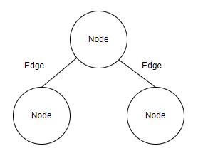
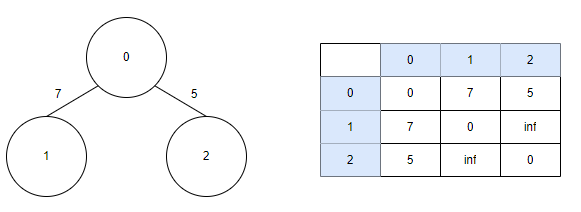

# 탐색 알고리즘 DFS/BFS

## 그래프

그래프는 `노드(Node)`와 `간선(Edge)`으로 표현되며 이때 노드를 `정점(Vertex)`이라고도 말한다. 그래프 탐색이랑 하나의 노드를 시작으로 다수의 노드를 방문하는 것을 말한다. 또한 두 노드가 간선으로 연결되어 있다면 '두 노드는 인접하다(Adjacent)'라고 표현한다.


프로그래밍에서 그래프는 크게 2가지 방식으로 표현할 수 있다.

1. 인접 행렬(Adjacency Matrix): 2차원 배열로 그래프의 연결 관계를 표현하는 방식
2. 인접 리스트(Adjacency List): 리스트로 그래프의 연결 관계를 표현하는 방식



`인접 행렬(Adjacency Matrix) 방식`은 2차원 배열에 각 노드가 연결된 형태를 기록하는 방식이다. 위와 같이 연결된 그래프를 인접 행렬로 표현할 때 파이썬에서는 2차원 리스트로 구현할 수 있다. 연결이 되어 있지 않은 노드끼리는 무한Infinity의 비용이라고 작성한다. 실제 코드에서는 논리적으로 정답이 될 수 없는 큰 값 중에서 999999999, 987654321 등의 값으로 초기화하는 경우가 많다. 이렇게 그래프를 인접 행렬 방식으로 처리할 때는 다음과 같이 데이터를 초기화한다.

```python
INF = 999999999

# 2차원 리스트를 이용해 인접 행렬 표현
graph = [
    [0, 7, 5],
    [7, 0 , INF],
    [5, INF, 0]
]

print(graph)
```


`인접 리스트(Adjacency List) 방식`은 '연결 리스트'라는 자료구조를 이용해 구현하는데, C++이나 자바와 같은 프로그래밍 언어에서는 별도로 리스트 기능을 위한 표준 라이브러리를 제공한다. 반면에 파이썬은 기본 자료형인 리스트 자료형이 append()와 메소드를 제공하므로, 전통적인 프로그래밍 언어에서의 배열과 연결 리스트의 기능을 모두 기본으로 제공한다. 파이썬으로 인접 리스트를 이용해 그래프를 표현하고자 할 떄에도 단순히 2차원 리스트를 이용하면 된다는 점만 기억하자.

다음은 예제 그래프를 인접 리스트 방식으로 처리할 때 데이터를 초기화한 코드이다.

```python
# 행이 3개인 2차원 리스트로 인접 리스트 표현
graph = [[] for _ in range(3)]

# 노드 0에 연결된 노드 정보 저장(노드, 거리)
graph[0].append((1,7))
graph[0].append((2,5))

# 노드 1에 연결된 노드 정보 저장(노드, 거리)
graph[1].append((0,7))

# 노드 2에 연결된 노드 정보 저장(노드, 거리)
graph[2].append((0,5))

print(graph)
```

이 두 방식은 어떤 차이가 있을까? 코딩 테스트를 위해 학습하는 터라 메모리와 속도 측면에서 살펴보겠다. 메모리 측면에서 보자면 인접 행렬 방식은 모든 관계를 저장하므로 노드 개수가 많을수록 메모리가 불필요하게 낭비된다. 반면에 인접 리스트 방식은 연결된 정보만을 저장하기 때문에 메모리를 효율적으로 사용한다. 하지만 이와 같은 속성 때문에 인접 리스트 방식은 인접 행렬 방식에 비해 특정한 두 노드가 연결되어 있는지에 대한 정보를 얻는 속도가 느리다. 인접 리스트 방식에서는 연결된 데이터를 하나씩 확인해야 하기 때문이다. 특정한 노드와 연결된 모든 인접 노드를 순회해야 하는 경우, 인접 리스트 방식이 인접 행렬 방식에 비해 메모리 공간의 낭비가 적다.

## DFS(Depth-First_Search)

`깊이 우선 탐색`이라고도 부르며, 그래프에서 `깊은 부분을 우선적으로 탐색하는 알고리즘`이다. 구체적인 동작은 다음과 같다.

1. 탐색 시작 노드를 스택에 삽입하고 방문 처리를 한다.
2. 스택의 최상단 노드에 방문하지 않은 인접 노드가 있으면 그 인접 노드를 스택에 넣고 방문 처리를 한다. 방문하지 않은 인접 노드가 없으면 스택에서 최상단 노드를 꺼낸다.
3. 2번 과정을 더 이상 수행할 수 없을 때까지 반복한다.

깊이 우선 탐색 알고리즘인 DFS는 스택 자료구조에 기초한다는 점에서 구현이 간단하다. 실제로는 스택을 쓰지 않아도 되며 탐색을 수행함에 있어서 데이터의 개수가 N개인 경우 O(N)의 시간이 소요된다는 특징이 있다.

또한 DFS는 스택을 이용하는 알고리즘이기 때문에 실제 구현은 재귀 함수를 이용했을 때 매우 간결하게 구현할 수 있다.

```python
# DFS 메서드 정의
def dfs(graph, v, visited):
    # 현재 노드를 방문 처리
    visited[v] = True
    print(v, end=' ')
    # 현재 노드와 연결된 다른 노드를 재귀적으로 방문
    for i in graph[v]:
        if not visited[i]:
            dfs(graph, i, visited)

# 각 노드가 연결된 정보를 리스트 자료형으로 표현(2차원 리스트)
graph = [
    [],
    [2,3,8],
    [1,7],
    [1,4,5],
    [3,5],
    [3,4],
    [7],
    [2,6,8],
    [1,7]
]

# 각 노드가 방문한 정보를 리스트 자료형으로 표현(1차원 리스트)
visited = [False] * 9

# 정의된 DFS 함수 호출
dfs(graph, 1, visited)
```

## BFS(Breadth First Search)

`너비 우선 탐색`이라는 의미를 가지며 `가까운 노드부터 탐색하는 알고리즘`이다. DFS는 최대한 멀리 있는 노드를 우선으로 탐색하는 방식으로 동작한다고 했는데, BFS는 반대다. BFS 구현에서는 큐 자료구조를 이용하는 것이 정석이다. 인접한 노드를 반복적으로 큐에 넣도록 알고리즘을 작성하면 자연스럽게 먼저 들어온 것이 먼저 나가게 되어, 가까운 노드부터 탐색을 진행하게 된다. 동작 방식은 다음과 같다.

1. 탐색 시작 노드를 큐에 삽입하고 방문 처리를 한다.
2. 큐에서 노드를 꺼내 해당 노드의 인접 노드 중에서 방문하지 않은 노드를 모두 큐에 삽입하고 방문 처리를 한다.
3. 2번의 과정을 더 이상 수행할 수 없을 때까지 반복한다.

너비 우선 탐색 알고리즘인 BFS는 큐 자료구조에 기초한다는 점에서 구현이 간단하다. 실제로 구현함에 있어 앞서 언급한 대로 deque 라이브러리를 사용하는 것이 좋으며 탐색을 수행함에 있어 O(N)의 시간이 소요된다. 일반적인 경우 실제 수행 시간은 DFS보다 좋은 편이라는 점까지만 추가로 기억하자.

> 재귀 함수로 DFS를 구현하면 컴퓨터 시스템의 특성상 실제 프로그램의 수행 시간은 느려질 수 있다. 따라서 스택 라이브러리를 이용해 시간 복잡도를 완화하는 테크닉이 필요할 때도 있다. 다만, 이 내용은 책의 범위를 벗어나므로, 코딩 테스트에서는 보통 DFS보다는 BFS 구현이 조금 더 빠르게 동작한다는 정도로 기억하자.

```python
from collections import deque

# BFS 메서드 정의
def bfs(graph, start, visited):
    # 큐(Queue) 구현을 위해 deque 라이브러리 사용
    queue = deque([start])
    
    # 현재 노드를 방문 처리
    visited[start] = True

    # 큐가 빌 때까지 반복
    while queue:
        # 큐에서 하나의 원소를 뽑아 출력
        v = queue.popleft()
        print(v, end=' ')

        # 해당 원소와 연결된, 아직 방문하지 않은 원소들을 큐에 삽입
        for i in graph[v]:
            if not visited[i]:
                queue.append(i)
                visited[i] = True

# 각 노드가 연결된 정보를 리스트 자료형으로 표현(2차원 리스트)
graph = [
    [],
    [2,3,8],
    [1,7],
    [1,4,5],
    [3,5],
    [3,4],
    [7],
    [2,6,8],
    [1,7]
]

# 각 노드가 방문한 정보를 리스트 자료형으로 표현(1차원 리스트)
visited = [False] * 9

# 정의된 BFS 함수 호출
bfs(graph, 1, visited)
```

코딩 테스트 중 2차원 배열에서의 탐색 문제를 만나면 이렇게 그래프 형태로 바꿔서 생각하면 풀이 방법을 조금 더 쉽게 떠올릴 수 있다. 그러므로 코딩 테스트에서 탐색 문제를 보면 그래프 형태로 표현한 다음 풀이법을 고민하도록 하자.

