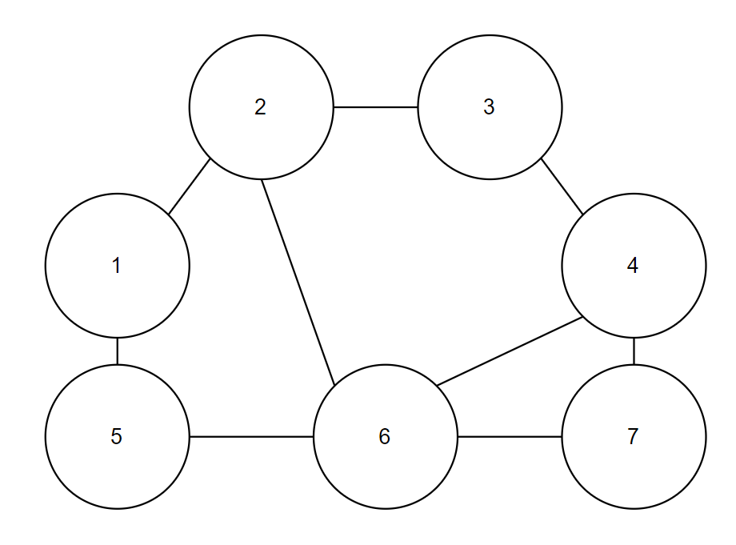
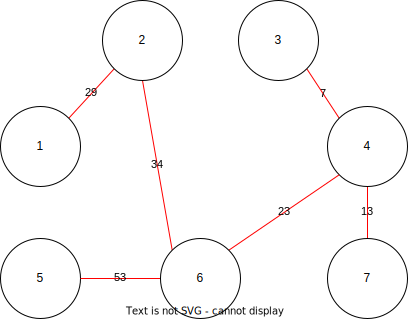
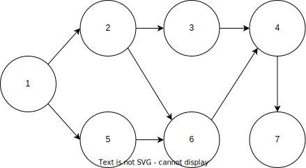

# 그래프 이론
여기서 다룰 알고리즘은 앞서 배운 내용에 기반하는데, 예를 들어 크루스칼 알고리즘Kruskal Algorithm은 그리디 알고리즘으로 분류되며, 위상 정렬 알고리즘Topology Algorithm은 앞서 배운 큐 자료구조 혹은 스택 자료구조를 활용해야 구현할 수 있다.

내용을 다루기 전에, 앞서 공부했던 그래프에 대해 복습해보자. 먼저 그래프란 노드와 노드 사이에 연결된 간선의 정보를 가지고 있는 자료구조를 말한다. 알고리즘 문제를 접했을 때 '서로 다른 개체(혹은 객체)Object가 연결되어 있다'는 이야기를 들으면 가장 먼저 그래프 알고리즘을 떠올려야 한다.

더불어 그래프 자료구조 중에서 트리Tree 자료구조는 다양한 알고리즘에서 사용되므로 꼭 기억하자. 9장의 '다익스트라 최단 거리 알고리즘'에서는 우선순위 큐가 사용되었는데, 우선순위 큐를 구현하기 위해 최소 힙Min Heap이나 최대 힙Max Heap을 이용할 수 있다고 했다. 최소 힙은 항상 부모 노드가 자식 노드보다 크기가 작은 자료구조로서 트리 자료구조에 속한다. 트리 자료구조는 부모에서 자식으로 내려오는 계층적인 모델에 속한다. 그래프와 트리 자료구조를 비교하면 다음 표의 내용과 같다. 참고로 트리는 전통적인 수학에서는 무방향 그래프로 간주되지만, 컴퓨터공학 분야에서는 보통 방향 그래프라고 간주된다.

||그래프|트리|
|---|---|---|
|방향성|방향 그래프 혹은 무방향 그래프|방향 그래프|
|순환성|순환 및 비순환|비순환|
|루트 노드 존재 여부|루트 노드가 없음|루트 노드가 존재|
|노드간 관계성|부모와 자식 관계 없음|부모와 자식 관계|
|모델의 종류|네트워크 모델|계층 모델|

또한 그래프의 구현 방법은 2가지 방식이 존재한다.
- 인접 행렬(Adjacency Matrix): 2차원 배열을 사용하는 방식
- 인접 리스트(Adjacency List): 리스트를 사용하는 방식

2가지 모두 그래프 알고리즘에서 매우 많이 사용된다. 두 방식은 메모리와 속도 측면에서 구별되는 특징을 가진다는 점을 기억하자.

노드의 개수가 V, 간선의 개수가 E인 그래프를 생각해보자. 인접 행렬을 이용하는 방식은 간선 정보를 저장하기 위해 O(V^2)만큼의 메모리 공간이 필요하다. 반면에 인접 리스트를 이용할 때는 간선의 개수만큼인 O(E)만큼만 메모리 공간이 필요하다. 또한 인접 행렬은 특정한 노드 A에서 다른 특정한 노드 B로 이어진 간선의 비용을 O(1)의 시간으로 즉시 알 수 있다는 장점이 있으며, 반면에 인접 리스트를 이용할 때는 O(V)만큼의 시간이 소요된다.

9장에서 우선순위 큐를 이용하는 다익스트라 최단 경로 알고리즘은 인접 리스트를 이용하는 방식이다. 노드의 개수가 V일 때는 V개의 리스트를 만들어서 각 노드와 연결된 모든 간선에 대한 정보를 리스트에 저장했다.

플로이드 워셜 알고리즘은 인접 행렬을 이용하는 방식이다. 모든 노드에 대하여 다른 노드로 가는 최소 비용을 V^2 크기의 2차원 리스트에 저장한 뒤에 해당 비용을 갱신해서 최단 거리를 계산했다. 이처럼 인접 행렬과 인접 리스트는 다양한 그래프 알고리즘에서 사용되고 있다.

알아두어야 할 점은 어떤 문제를 만나도 메모리와 시간을 염두에 두고 알고리즘을 선택해서 구현해야 한다는 것이다. 예를 들어 최단 경로를 찾아야 하는 문제가 출제되었을 때, 노드의 개수가 적은 경우에는 플로이드 워셜 알고리즘을 이용할 수 있다. 반면에 노드와 간선의 개수가 모두 많으면 우선순위 큐를 이용하는 다익스트라 알고리즘을 이용하면 유리하다.

## 서로소 집합
수학에서 `서로소 집합Disjoint Sets`이란 `공통 원소가 없는 두 집합`을 의미한다. 예를 들어 집합 {1,2}와 {3,4}는 서로소 관계이다.

서로소 집합 자료구조를 설명하려면 서로소 집합 개념이 필요하다. 서로소 집합 자료구조는 몇몇 그래프 알고리즘에서 매우 중요하게 사용되므로 그래프 알고리즘 이론 전에 알아보자.

서로소 집합 자료구조란 `서로소 부분 집합들로 나누어진 원소들의 데이터를 처리하기 위한 자료구조`라고 할 수 있다. 서로소 집합 자료구조는 union과 find 이 2개의 연산으로 조작할 수 있다.

union합집합 연산은 2개의 원소가 포함된 집합을 하나의 집합으로 합치는 연산이다. find찾기 연산은 특정한 원소가 속한 집합이 어떤 집합인지 알려주는 연산이다. 스택과 큐가 각각 push와 pop 연산으로 이루어졌던 것처럼, 서로소 집합 자료구조는 합집합과 찾기 연산으로 구성된다.

서로소 집합 자료구조는 union-find 자료구조라고 불리기도 한다. 연산의 이름 자체가 합치기와 찾기이기도 하고, 두 집합이 서로소 관계인지를 확인할 수 있다는 말은 각 집합이 어떤 원소를 공통으로 가지고 있는지를 확인할 수 있다는 말과 같기 때문이다.

서로소 집합 자료구조를 구현할 때는 트리 자료구조를 이용하여 집합을 표현하는데, 서로소 집합 정보(합집합 연산)가 주어졌을 때 트리 자료구조를 이용해서 집합을 표현하는 서로소 집합 계산 알고리즘은 다음과 같다.

1. union(합집합) 연산을 확인하여, 서로 연결된 두 노드 A,B를 확인한다.
    1. A와 B의 루트 노드 A',B'를 각각 찾는다.
    2. A'를 B'의 부모 노드로 설정한다.(B'가 A'를 가리키도록 한다).
2. 모든 union(합집합) 연산을 처리할 때까지 1번 과정을 반복한다.

이것이 트리를 이용해 서로소 집합을 계산하는 알고리즘이다. 또한 실제로 구현할 때는 A'과 B' 중에서 더 번호가 작은 원소가 부모 원소가 되도록 구현하는 경우가 많으므로, 이 책에서도 그러한 구현 방식을 따르도록 하겠다. A'가 1이고, B'가 3이라면, B'가 A'를 가리키도록 설정한다. 여기서 '가리킨다'는 표현은 부모 노드로 설정한다는 의미이다. 예를 들어 B'가 A'를 부모 노드로 설정하는 것을 그래프로 시각화할 때, B'와 A'를 간선으로 연결하는 형태로 그래프를 그릴 수 있다.

예시를 통해서 서로소 집합 계산 알고리즘의 동작 방식을 이해해보도록 하자. 이번에는 전체 집합 {1,2,3,4,5,6}이 6개의 원소로 구성되어 있는 상황을 생각해보자. 이때 다음과 같은 4개의 union 연산이 주어져 있다.

- union 1,4
- union 2,3
- union 2,4
- union 5,6

이러한 4개의 union 연산은 각각 '1과 4는 같은 집합', '2와 3은 같은 집합', '2와 4는 같은 집합', '5와 6은 같은 집합'이라는 의미를 가지고 있다. 다시 말해 총 4개의 union 연산이 존재하는 것이다. 이때 4개의 union 연산이 수행된 후에, 전체 원소들이 결과적으로 어떠한 형태의 부분 집합으로 나누어질지 확인해보자.

이러한 union 연산들은 그래프 형태로 표현될 수도 있다. 각 원소는 그래프에서 노드로 표현되고, '같은 집합에 속한다'는 정보를 담은 union 연산들은 간선으로 표현된다. 즉, 6개의 노드가 있고 4개의 간선이 존재하는 그래프로 바꾸어서 생각할 수 있다.

[step 0]
초기 단계에서는 가장 먼저 노드의 개수(V) 크기의 부모 테이블을 초기화한다. 이때 모든 원소가 자기 자신을 부모로 가지도록 설정한다. 현재 원소의 개수가 6이므로, 초기 단계에서는 총 6개의 트리가 존재하는 것과 같다. 여기에서 유의할 점은 부모 테이블은 말 그대로 부모에 대한 정보만을 담고 있다. 다시 말해 특정한 노드의 부모에 대해서만 저장하고 있다. 우리가 실제로 루트를 확인하고자 할 때는 재귀적으로 부모를 거슬러 올라가서 최종적인 루트 노드를 찾아야 한다.
```
Node   1 2 3 4 5 6
Parent 1 2 3 4 5 6
```

[step 1] union 1,4
첫 번째 union 연산을 확인하면, 1과 4를 합친다. 이때는 노드 1과 노드 4의 루트 노드를 각각 찾으면 된다. 현재 루트 노드는 각각 1과 4이기 때문에 더 큰 번호에 해당하는 루트 노드 4의 부모를 1로 설정한다.
```
Node   1 2 3 4 5 6
Parent 1 2 3 1 5 6
```

[step 2] union 2,3
현재 union 연산을 확인하면, 2와 3을 합친다. 따라서 노드 2와 노드 3의 루트 노드를 각각 찾으면 된다. 현재 루트 노드는 각각 2와 3이기 때문에 더 큰 번호에 해당하는 루트 노드 3의 부모를 2로 설정한다.
```
Node   1 2 3 4 5 6
Parent 1 2 2 1 5 6
```

[step 3] union 2,4
다시 union 연산을 확인하면, 2와 4를 합친다. 따라서 노드 2와 노드 4의 루트 노드를 각가 찾으면 된다. 현재 루트 노드는 각각 2와 1이기 때문에 더 큰 번호에 해당하는 루트 노드 2의 부모를 1로 설정한다.
```
Node   1 2 3 4 5 6
Parent 1 1 2 1 5 6
```

[step 4] union 5,6
마지막 union 연산을 확인하면, 5와 6을 합친다. 따라서 노드 5와 노드 6의 로트 노드를 각각 찾으면 된다. 현재 루트 노드는 각각 5와 6이기 때문에 더 큰 번호에 해당하는 루트 노드 6의 부모를 5로 설정한다.
```
Node   1 2 3 4 5 6
Parent 1 1 2 1 5 5
```

이상으로 모든 union 연산을 처리했다. 이 알고리즘에서 유의할 점은 우리는 union 연산을 효과적으로 수행하기 위해 '부모 테이블'을 항상 가지고 있어야 한다는 점이다. 또한 루트 노드를 계산할 수 없고, 부모 테이블을 계속해서 확인하며 거슬러 올라가야 한다. 예를 들어 [step 4]에서 노드 3의 부모는 노드 2라고 설정되어 있다. 다만, 노드 2의 부모는 1이기 때문에 최종적으로 노드 3의 루트 노드는 1이라고 할 수 있다. 다시 말해 서로소 집합 알고리즘으로 루트를 찾기 위해서는 재귀적으로 부모를 거슬러 올라가야 한다는 점을 기억하자.

[10-1_서로소_집합_알고리즘.py](10-1_서로소_집합_알고리즘.py)
```python
# 특정 원소가 속한 집합을 찾기
def find_parent(parent, x):
    # 루트 노드가 아니라면, 루트 노드를 찾을 때까지 재귀적으로 호출
    if parent[x] != x:
        return find_parent(parent, parent[x])
    return x

# 두 원소가 속한 집합을 찾기
def union_parent(parent, a, b):
    a = find_parent(parent, a)
    b = find_parent(parent, b)
    if a < b:
        parent[b] = a
    else:
        parent[a] = b

# 노드의 개수와 간선(union 연산)의 개수 입력받기
v, e = map(int, input().split())
parent = [0] * (v + 1) # 부모 테이블 초기화

# 부모 테이블상에서, 부모를 자기 자신으로 초기화
for i in range(1, v + 1):
    parent[i] = i

# union 연산을 각각 수행
for i in range(e):
    a, b = map(int, input().split())
    union_parent(parent, a, b)

# 각 원소가 속한 집합 출력
print('각 원소가 속한 집합: ', end='')
for i in range(1, v + 1):
    print(find_parent(parent, i), end=' ')

print()

# 부모 테이블 내용 출력
print('부모 테이블: ', end='')
for i in range(1, v + 1):
    print(parent[i], end=' ')
```
결과적으로 모든 원소에 대하여 각 원소가 속한 집합을 출력하게 하면 차례대로 1,1,1,1,5,5라고 출력된 것을 알 수 있다. 이는 1부터 6까지의 각 원소의 루트 노드가 1,1,1,1,5,5라는 의미이다. 이 루트 노드가 같은 원소끼리는 동일한 집합을 이룬다. 다시 말해 전체 원소가 {1,2,3,4}와 {5,6}으로 나누어지는 것으로 이해할 수 있다.

다만, 이렇게 구현하면 답을 구할 수는 있지만, find 함수가 비효율적으로 동작한다. 최악의 경우 find 함수가 모든 노드를 다 확인하는 터라 시간 복잡도가 O(V)라는 점이다.

다음과 같이 {1,2,3,4,5}의 총 5개의 원소가 존재하는 상황에서 모두 같은 집합에 속하는 경우를 가정해보자. 구체적으로 4개의 union 연산이 순서대로 (4,5), (3,4), (2,3), (1,2)와 같이 주어졌다고 해보자.

```
node   1 2 3 4 5
parent 1 1 2 3 4
```

1부터 5까지의 모든 원소가 루트 노드로 1이라는 값을 가진다. 하지만 실제로 부모 테이블에 담겨 있는 1부터 5까지의 노드에 대한 부모 노드 값은 차례대로 1,1,2,3,4가 된다. 예를 들어 노드 5의 루트를 찾기 위해서는 '노드5 -> 노드4 -> 노드3 -> 노드2 -> 노드1' 순서대로 부모 노드를 거슬러 올라가야하므로 최대 O(V)의 시간이 소요될 수 있다. 결과적으로 현재의 알고리즘을 그대로 이용하게 되면 노드의 개수가 V개이고 find 혹은 union 연산의 개수가 M개일 때, 전체 시간 복잡도는 O(VM)이 되어 비효율적이다.

하지만 이런 find 함수는 아주 간단한 과정으로 최적화가 가능하다. 바로 경로 압축Path Compression 기법을 적용하면 시간 복잡도를 개선시킬 수 있다. 경로 압축은 find 함수를 재귀적으로 호출한 뒤에 부모 테이블값을 갱신하는 기법이다. 기존의 find 함수를 다음과 같이 변경하면 경로 압축 기법의 구현이 완료된다.

```python
def find_parent(parent, x):
    if parent[x] != x:
        parent[x] = find_parent(parent, parent[x])
    return parent[x]
```

이렇게 함수를 수정하면 각 노드에 대하여 find 함수를 호출한 이후에, 해당 노드의 루트 노드가 바로 부모 노드가 된다. 아까와 동일하게 {1,2,3,4,5}의 총 5개의 원소가 존재하는 상황에서 4개의 union 연산이 순서대로 (4,5), (3,4), (2,3), (1,2)와 같이 주어졌다고 가정해보자. 이때 모든 union 함수를 처리한 후 각 원소에 대하여 find 함수를 수행하면 다음과 같이 부모 테이블이 형성된다. 결과적으로 경로 압축 기법을 이용하게 되면 루트 노드에 더욱 빠르게 접근할 수 있다는 점에서 기존의 기본적인 알고리즘과 비교했을 때 시간 복잡도가 개선된다.

```
node   1 2 3 4 5
parent 1 1 1 1 1
```

[10-3_개선된_서로소_집합_알고리즘.py](10-3_개선된_서로소_집합_알고리즘.py)
```python
# 특정 원소가 속한 집합을 찾기
def find_parent(parent, x):
    # 루트 노드가 아니라면, 루트 노드를 찾을 때까지 재귀적으로 호울
    if parent[x] != x:
        parent[x] = find_parent(parent, parent[x])
    return parent[x]

# 두 원소가 속한 집합을 찾기
def union_parent(parent, a, b):
    a = find_parent(parent, a)
    b = find_parent(parent, b)
    if a < b:
        parent[b] = a
    else:
        parent[a] = b

# 노드의 개수와 간선(union 연산)의 개수 입력받기
v, e = map(int, input().split())
parent = [0] * (v + 1) # 부모 테이블 초기화

# 부모 테이블상에서, 부모를 자기 자신으로 초기화
for i in range(1, v + 1):
    parent[i] = i

# union 연산을 각각 수행
for i in range(e):
    a, b = map(int, input().split())
    union_parent(parent, a, b)

# 각 원소가 속한 집합 출력
print('각 원소가 속한 집합: ', end='')
for i in range(1, v + 1):
    print(find_parent(parent, i), end=' ')

print()

# 부모 테이블 내용 출력
print('부모 테이블: ', end='')
for i in range(1, v + 1):
    print(parent[i], end=' ')
```

## 서로소 집합 알고리즘의 시간 복잡도
서로소 집합 알고리즘을 구현할 때, 경로 압축 방법만을 이용할 경우의 시간 복잡도를 알아보자. 노드의 개수가 V개이고, 최대 V-1개의 union 연산과 M개의 find 연산이 가능할 때 경로 압축 방법을 적용한 시간 복잡도는 O(V+M(1 + log_(m/v)V))라는 것이 알려져 있다. 예를 들어 노드의 개수가 1,000개이고, union 및 find 연산이 총 100만 번 수행된다고 하자. 그러면 이 경우 정확하지 않지만, 대략 V + MlogV를 계산해서 약 1,000만 번 가량의 연산이 필요하다고 이해하면 된다.

사실 경로 압축을 제외하고도, 시간 복잡도를 줄일 수 있는 방법은 여러 가지가 있다. 하지만 프로그래밍 대회가 아니라면 (코딩 테스트 수준에서는) 경로 압축만 적용해도 충분하다.

## 서로소 집합을 활용한 사이클 판별
서로소 집합은 다양한 알고리즘에 사용될 수 있다. 특히 서로소 집합은 무방향 그래프 내에서의 사이클을 판별할 때 사용할 수 있다는 특징이 있다. 참고로 방향 그래프에서의 사이클 여부는 DFS를 이용하여 판별할 수 있다.

앞서 union 연산은 그래프에서의 간선으로 표현될 수 있다고 했다. 따라서 간선을 하나씩 확인하면서 두 노드가 포함되어 있는 집합을 합치는 과정을 반복하는 것만으로도 사이클을 판별할 수 있다. 알고리즘은 다음과 같다.

1. 각 간선을 확인하며 두 노드의 루트 노드를 확인한다.
  1. 루트 노드가 서로 다르다면 두 노드에 대하여 union 연산을 수행한다.
  2. 루트 노드가 서로 같다면 사이클(cycle)이 발생한 것이다.
2. 그래프에 포함되어 있는 모든 간선에 대하여 1번 과정을 반복한다.

[step 0]
초기 단계에서는 모든 노드에 대하여 자기 자신을 부모로 설정하는 형태로 부모 테이블을 초기화한다.
```
node   1 2 3
parent 1 2 3
```

[step 1]
가장 먼저 간선 (1,2)를 확인한다. 노드 1과 노드 2의 루트 노드는 각각 1과 2이다. 따라서 더 큰 번호를 갖는 노드 2의 부모 노드를 1로 변경한다.
```
node   1 2 3
parent 1 1 3
```

[step 2]
이어서 간선 (1,3)을 확인한다. 노드 1과 노드 3의 루트 노드는 각각 1과 3이다. 따라서 더 큰 번호를 갖는 노드 3의 부모 노드를 1로 변경한다.
```
node   1 2 3
parent 1 1 1
```

[step 3]
이후에 (2,3) 간선을 확인한다. 다만, 이때 노드 2와 노드 3이 이미 루트 노드로 '노드1'을 가지고 있다. 다시 말해서 사이클이 발생한다는 것을 알 수 있다.

이러한 사이클 판별 알고리즘은 그래프에 포함되어 있는 간선의 개수가 E개일 때 모든 간선을 하나씩 확인하며, 매 간선에 대하여 union 및 find 함수를 호출하는 방식으로 동작한다. 이 알고리즘은 간선에 방향성이 없는 무향 그래프에서만 적용 가능하다.

[10-4_서로소_집합_사이클_판별.py](10-4_서로소_집합_사이클_판별.py)
```python
# 특정 원소가 속한 집합을 찾기
def find_parent(parent, x):
    # 루트 노드가 아니라면, 루트 노드를 찾을 때까지 재귀적으로 호출
    if parent[x] != x:
        parent[x] = find_parent(parent, parent[x])
    return parent[x]

# 두 원소가 속한 집합을 합치기
def union_parent(parent, a, b):
    a = find_parent(parent, a)
    b = find_parent(parent, b)
    if a < b:
        parent[b] = a
    else:
        parent[a] = b

# 노드의 개수와 간선(union 연산)의 개수 입력받기
v, e = map(int, input().split())
parent = [0] * (v + 1) # 부모 테이블 초기화

# 부모 테이블상에서, 부모를 자기 자신으로 초기화
for i in range(1, v + 1):
    parent[i] = i

cycle = False # 사이클 발생 여부

for i in range(e):
    a, b = map(int, input().split())
    # 사이클이 발생한 경우 종료
    if find_parent(parent, a) == find_parent(parent, b):
        cycle = True
        break
    # 사이클이 발생하지 않았다면 합집합(union) 수행
    else:
        union_parent(parent, a, b)

if cycle:
    print("사이클이 발생했습니다.")
else:
    print("사이클이 발생하지 않았습니다.")
```

## 신장 트리
신장 트리는 그래프 알고리즘 문제로 자주 출제되는 문제 유형이다. 기본적으로 신장 트리Spanning Tree란 `하나의 그래프가 있을 때 모든 노드를 포함하면서 사이클이 존재하지 않는 부분 그래프`를 의미한다. 이때 모든 노드가 포함되어 서로 연결되면서 사이클이 존재하지 않는다는 조건은 트리의 성립 조건이기도 하다. 그래서 이러한 그래프를 신장 트리라고 부르는 것이다. 예를 들어 다음과 같은 그래프에서는 여러 개의 신장 트리를 찾을 수 있다.


이런 그래프에서


가능한 신장 트리 중 하나

## 크루스칼 알고리즘
우리는 다양한 문제 상황에서 가능한 한 최소한의 비용으로 신장 트리를 찾아야 할 때가 있다. 예를 들어 N개의 도시가 존재하는 상황에서 두 도시 사이에 도로를 놓아 전체 도시가 서로 연결될 수 있게 도로를 설치하는 경우를 생각해보자. 2개의 도시 A,B를 선택했을 때, 도시 A에서 도시 B로 이동하는 경로가 반드시 존재하도록 도로를 설치하고자 한다. 모든 도시를 '연결'할 때, 최소한의 비용으로 연결하려면 어떤 알고리즘을 이용해야 할까?

예를 들어 다음과 같은 그래프가 있다고 가정해보자. 3개의 도시가 있고 각 도시 간 도로를 건설하는 비용은 23, 13, 25이다.


여기서 노드 1,2,3을 모두 연결하기 위해서 가장 최소한의 비용을 가지는 신장 트리는 36이다.
1. 23 + 13 = 36
2. 23 + 25 = 48
3. 25 + 13 = 38


이처럼 신장 트리 중에서 최소 비용으로 만들 수 있는 신장 트리를 찾는 알고리즘을 '최소 신장 트리 알고리즘'이라고 한다. 대표적인 최소 신장 트리 알고리즘으로는 `크루스칼 알고리즘Krusukal Algorithm`이 있다.

크루스칼 알고리즘을 사용하면 가장 적은 비용으로 모든 노드를 연결할 수 있는데 크루스칼 알고리즘은 그리디 알고리즘으로 분류된다. 먼저 모든 간선에 대하여 정렬을 수행한 뒤에 가장 거리가 짧은 간선부터 집합에 포함시키면 된다. 이때 사이클을 발생시킬 수 있는 간선의 경우, 집합에 포함시키지 않는다. 구체적인 알고리즘을 살펴보면 다음과 같다.

1. 간선 데이터를 비용에 따라 오름차순으로 정렬한다.
2. 간선을 하나씩 확인하며 현재의 간선이 사이클을 발생시키는지 확인한다.
  1. 사이클이 발생하지 않는 경우 최소 신장 트리에 포함시킨다.
  2. 사이클이 발생하는 경우 최소 신장 트리에 포함시키지 않는다.
3. 모든 간선에 대하여 2번의 과정을 반복한다.


최소 신장 트리는 일종의 트리Tree 자료구조이므로, 최종적으로 신장 트리에 포함되는 간선의 개수가 '노드의 개수 - 1'과 같다는 특징이 있다. 예를 들어 아래 예시에서는 노드의 개수가 7이고 간선의 개수가 6인 것을 확인할 수 있다.


따라서 크루스칼 알고리즘의 핵심 원리는 가장 거리가 짧은 간선부터 차례대로 집합에 추가하면 된다는 것이다. 다만, 사이클을 발생시키는 간선은 제외하고 연결한다. 이렇게 하면 항상 최적의 해를 보장할 수 있다. 크루스칼 알고리즘을 이용해서 최소 신장 트리를 찾는 과정을 확인해보자.

[step 0]
초기 단계에서는 그래프의 모든 간선 정보만 따로 빼내어 정렬을 수행한다. 현재 전체 그래프에 존재하는 간선이 9개인 것을 알 수 있다. 따라서 맨 처음에는 모든 간선을 정렬한다. 실제로는 전체 간선 데이터를 리스트에 담은 뒤에 이를 정렬하지만, 가독성을 위해 다음 그림에서는 노드 데이터를 순서에 따라 테이블 내에 데이터를 나열했다.


|||||||||||
|---|---|---|---|---|---|---|---|---|---|
|간선|(1,2)|(1,5)|(2,3)|(2,6)|(3,4)|(4,6)|(4,7)|(5,6)|(6,7)|
|비용|29|75|35|34|7|23|13|53|25|

[step 1]
첫 번째 단계에서는 가장 짧은 간선을 선택한다. 따라서 (3,4)가 선택되고 이것을 집합에 포함하면 된다. 다시 말해 노드 3과 노드 4에 대하여 union 함수를 수행하면 된다. 그래서 노드 3과 노드 4를 동일한 집합에 속하도록 만든다.


|||||||||||
|---|---|---|---|---|---|---|---|---|---|
|간선|(1,2)|(1,5)|(2,3)|(2,6)|(3,4)|(4,6)|(4,7)|(5,6)|(6,7)|
|비용|29|75|35|34|7|23|13|53|25|
|순서|||||step 1|||||

[step 2]
그다음으로 비용이 가장 작은 간선이 (4,7)을 선택한다. 현재 노드 4와 노드 7은 같은 집합에 속해 있지 않기 때문에 노드 4와 노드 7에 대하여 union 함수를 호출한다.


|||||||||||
|---|---|---|---|---|---|---|---|---|---|
|간선|(1,2)|(1,5)|(2,3)|(2,6)|(3,4)|(4,6)|(4,7)|(5,6)|(6,7)|
|비용|29|75|35|34|7|23|13|53|25|
|순서|||||step 1||step 2|||

[step 3]
그다음으로 비용이 가장 작은 간선인 (4,6)을 선택한다. 현재 노드 4와 6은 같은 집합에 속해 있지 않기 때문에, 노드 4와 노드 6에 대하여 union 함수를 호출한다.


|||||||||||
|---|---|---|---|---|---|---|---|---|---|
|간선|(1,2)|(1,5)|(2,3)|(2,6)|(3,4)|(4,6)|(4,7)|(5,6)|(6,7)|
|비용|29|75|35|34|7|23|13|53|25|
|순서|||||step 1|step 3|step 2|||

[step 4]
그다음으로 비용이 가장 작은 간선인 (6,7)을 선택한다. 선택된 노드 6과 노드 7의 루트 노드를 확인한다. 다만 노드 6과 노드 7의 루트가 이미 동일한 집합에 포함되어 있으므로 신장 트리에 포함하지 않아야 한다. 따라서 union 함수를 호출하지 않는다. 앞으로의 단계에 대해서, 처리가 되었지만 신장 트리에 포함되지 않는 간선은 점선으로 표시하겠다.


|||||||||||
|---|---|---|---|---|---|---|---|---|---|
|간선|(1,2)|(1,5)|(2,3)|(2,6)|(3,4)|(4,6)|(4,7)|(5,6)|(6,7)|
|비용|29|75|35|34|7|23|13|53|25|
|순서|||||step 1|step 3|step 2||step 4|

[step 5]
그다음으로 비용이 가장 작은 간선 (1,2)를 선택한다. 현재 노드 1과 노드 2는 같은 집합에 속해 있지 않기 때문에, 노드 1과 노드 2에 대하여 union 함수를 호출한다.


|||||||||||
|---|---|---|---|---|---|---|---|---|---|
|간선|(1,2)|(1,5)|(2,3)|(2,6)|(3,4)|(4,6)|(4,7)|(5,6)|(6,7)|
|비용|29|75|35|34|7|23|13|53|25|
|순서|step 5||||step 1|step 3|step 2||step 4|

[step 6]
그다음으로 비용이 가장 작은 간선 (2,6)을 선택한다. 현재 노드 2와 노드 6은 같은 집합에 속해 있지 않기 때문에, 노드 2와 노드 6에 대하여 union 함수를 호출한다.


|||||||||||
|---|---|---|---|---|---|---|---|---|---|
|간선|(1,2)|(1,5)|(2,3)|(2,6)|(3,4)|(4,6)|(4,7)|(5,6)|(6,7)|
|비용|29|75|35|34|7|23|13|53|25|
|순서|step 5|||step 6|step 1|step 3|step 2||step 4|

[step 7]
그다음으로 비용이 가장 작은 간선인 (2,3)을 선택한다. 선택된 노드 2와 노드 3의 루트 노드를 확인한다. 다만, 노드 2와 노드 3의 루트가 이미 동일한 집합에 포함되어 있으므로 union 함수를 호출하지 않는다.


|||||||||||
|---|---|---|---|---|---|---|---|---|---|
|간선|(1,2)|(1,5)|(2,3)|(2,6)|(3,4)|(4,6)|(4,7)|(5,6)|(6,7)|
|비용|29|75|35|34|7|23|13|53|25|
|순서|step 5||step 7|step 6|step 1|step 3|step 2||step 4|

[step 8]
그다음으로 비용이 가장 작은 간선 (5,6)을 선택한다. 선택된 노드 5와 노드 6은 같은 집합에 속해 있지 않기 때문에, 노드 5와 노드 6에 대하여 union 함수를 호출한다.


|||||||||||
|---|---|---|---|---|---|---|---|---|---|
|간선|(1,2)|(1,5)|(2,3)|(2,6)|(3,4)|(4,6)|(4,7)|(5,6)|(6,7)|
|비용|29|75|35|34|7|23|13|53|25|
|순서|step 5|||step 6|step 1|step 3|step 2|step 8|step 4|

[step 9]
그다음으로 비용이 가장 작은 간선인 (1,5)을 선택한다. 선택된 노드 1와 노드 5의 루트 노드를 확인한다. 다만, 노드 1와 노드 5의 루트가 이미 동일한 집합에 포함되어 있으므로 union 함수를 호출하지 않는다.


|||||||||||
|---|---|---|---|---|---|---|---|---|---|
|간선|(1,2)|(1,5)|(2,3)|(2,6)|(3,4)|(4,6)|(4,7)|(5,6)|(6,7)|
|비용|29|75|35|34|7|23|13|53|25|
|순서|step 5|step 9|step 7|step 6|step 1|step 3|step 2|step 8|step 4|

결과적으로 우리는 다음과 같은 최소 신장 트리를 찾을 수 있다.



또한 최소 신장 트리에 포함되어 있는 간선의 비용만 모두 더하면, 그 값이 최종 비용에 해당한다. 위의 예시에서 총비용은 159이다. 최소 신장 트리를 만드는데 필요한 비용을 계산하는 크루스칼 알고리즘의 소스코드는 다음과 같다.

[10-5_최소_신장_트리_크루스칼_알고리즘.py](10-5_최소_신장_트리_크루스칼_알고리즘.py)
```python
# 특정한 원소가 속한 집합을 찾기
def find_parent(parent, x):
    # 루트 노드가 아니라면, 루트 노드를 찾을 때까지 재귀적으로 호출
    if parent[x] != x:
        parent[x] = find_parent(parent, parent[x])
    return parent[x]

# 두 원소가 속한 집합을 합치기
def union_parent(parent, a, b):
    a = find_parent(parent, a)
    b = find_parent(parent, b)
    if a < b:
        parent[b] = a
    else:
        parent[a] = b

# 노드의 개수와 간선(union 연산)의 개수 입력받기
v, e = map(int, input().split())
parent = [0] * (v + 1) # 부모 테이블 초기화

# 모든 간선을 담을 리스트와 비용을 담을 변수
edges = []
result = 0

# 부모 테이블상에서, 부모를 자기 자신으로 초기화
for i in range(1, v + 1):
    parent[i] = i

# 모든 간선에 대한 정보를 입력받기
for _ in range(e):
    a, b, cost = map(int, input().split())
    # 비용순으로 정렬하기 위해서 튜플의 첫 번째 원소를 비용으로 설정
    edges.append((cost, a, b))

# 간선을 비용순으로 정렬
edges.sort()

# 간선을 하나씩 확인하며
for edge in edges:
    cost, a, b = edge
    # 사이클이 발생하지 않는 경우에만 집합에 포함
    if find_parent(parent, a) != find_parent(parent, b):
        union_parent(parent, a, b)
        result += cost

print(result)
```

### 크루스칼 알고리즘의 시간 복잡도
크루스칼 알고리즘은 간선의 개수가 E개일 때, O(ElogE)의 시간 복잡도를 가진다. 왜냐하면 크루스칼 알고리즘에서 시간이 가장 오래 걸리는 부분이 간선을 정렬하는 작업이며, E개의 데이터를 정렬했을 때의 시간 복잡도는 O(ElogE)이기 때문이다. 크루스칼 내부에서 사용되는 서로소 집합 알고리즘의 시간 복잡도는 정렬 알고리즘의 시간 복잡도보다 작으므로 무시한다.

## 위상 정렬
`위상 정렬Topology Sort`은 정렬 알고리즘의 일종이다. 위상 정렬은 순서가 정해져 있는 일련의 작업을 차례대로 수행해야 할 때 사용할 수 있는 알고리즘이다. 조금 더 이론적으로 설명하자면, 위상 정렬이란 `방향 그래프의 모든 노드를 '방향성에 거스르지 않도록 순서대로 나열하는 것'`이다.

현실 세계에서 위상 정렬을 수행하게 되는 전형적인 예시로는 '선수과목을 고려한 학습 순서 설정'을 들 수 있다. 예를 들어 컴퓨터공학과 커리큘럼에는 '자료구조' 과목을 수강한 뒤에 '알고리즘' 강의를 수강하는 것을 권장한다. 이때 '자료구조' 및 '알고리즘'을 각각의 노드로 표현하고, '자료구조'에서 '알고리즘'으로 이어질 수 있도록 방향성을 갖는 간선을 그릴 수 있다. 다시 말해 그래프상에서 선후관계가 있다면, 위상 정렬을 수행하여 모든 선후관계를 지키는 전체 순서를 계산할 수 있다.

다시 예를 들면 컴퓨터공학과의 커리큘럼이 총 3개의 과목만으로 구성되고 '알고리즘'의 선수과목으로 '자료구조'가 있다고 가정하자. 또한 '고급 알고리즘'의 선수과목으로 '자료구조'와 '알고리즘'이 있다고 가정하자. 이 경우 모든 과목을 수강하기 위해서는 '자료구조 -> 알고리즘 -> 고급 알고리즘' 순서로 강의를 수강해야 한다.

위상 정렬 알고리즘을 자세히 살펴보기 전에, 먼저 진입차수Indegree를 알아야 한다. 진입차수란 특정한 노드로 '들어오는' 간선의 개수를 의미한다. 컴퓨터공학과의 커리큘럼 예시에서 '고급 알고리즘' 노드를 확인해보자. '고급 알고리즘' 노드는 2개의 선수과목을 가지고 있다. 다시 말해 그래프상에서 진입차수가 2인 것을 확인할 수 있다. 이제 주어진 방향 그래프에서 위상 정렬을 수행하는 구체적인 알고리즘을 살펴보자. 위상 정렬 알고리즘은 다음과 같다.

1. 진입차수가 0인 노드를 큐에 넣는다.
2. 큐가 빌 때까지 다음의 과정을 반복한다.
  1. 큐에서 원소를 꺼내 해당 노드에서 출발하는 간선을 그래프에서 제거한다. 
  2. 새롭게 진입차수가 0이 된 노드를 큐에 넣는다.

이 알고리즘을 이용하여 간단하게 위상 정렬을 수행할 수 있다. 알고리즘에서도 확인할 수 있듯이 큐가 빌 때까지 원소를 계속 꺼내서 처리하는 과정을 반복한다. 이때 모든 원소를 방문하기 전에 큐가 빈다면 사이클이 존재한다고 판단할 수 있다. 다시 말해 큐에서 원소가 V번 추출되기 전에 큐가 비어버리면 사이클이 발생한 것이다. 사이클이 존재하는 경우 사이클에 포함되어 있는 원소 중에서 어떠한 원소도 큐에 들어가지 못하기 때문이다. 다만, 기본적으로 위상 정렬 문제에서는 사이클이 발생하지 않는다고 명시하는 경우가 더 많으므로, 여기서는 사이클이 발생하는 경우는 고려하지 않으며 2절의 실전 문제에 사이클이 발생하는 경우를 처리하는 문제를 수록하였다.

다음 그래프를 예로 설명하겠다.



[step 0]
초기 단계에서는 진입차수가 0인 노드를 큐에 넣는다. 현재 노드 1의 진입차수만 0이기 때문에 큐에 노드 1만 삽입한다. 큐에 삽입된 노드는 그림처럼 색을 다르게 표현했다.


[step 1]
먼저 큐에 들어 있는 노드 1을 꺼낸다. 이제 노드 1과 연결되어 있는 간선들을 제거한다. 그러면 새롭게 노드 2와 노드 5의 진입차수가 0이 된다. 따라서 노드 2와 노드 5를 큐에 삽입한다. 처리된 노드와 간선은 점선으로 표기한다.


[step 2]
그다음 큐에 들어 있는 노드 2를 꺼낸다. 이제 노드 2와 연결되어 있는 간선들은 제거한다. 그러면 새롭게 노드 3의 진입차수가 0이 된다. 따라서 노드 3을 큐에 삽입한다.


[step 3]
그다음 큐에 들어 있는 노드 5를 꺼낸다. 이제 노드 5와 연결되어 있는 간선들을 제거한다. 그러면 새롭게 노드 6의 진입차수가 0이 된다. 따라서 노드 6을 큐에 삽입한다.


[step 4]
그다음 큐에 들어 있는 노드 3을 꺼낸다. 이제 노드 3과 연결되어 있는 간선들을 제거한다. 이번 단계에서는 새롭게 진입차수가 0이 되는 노드가 없으므로 그냥 넘어간다.


[step 5]
그다음 큐에 들어 있는 노드 6을 꺼낸다. 이제 노드 6과 연결되어 있는 간선을 제거한다. 그러면 새롭게 노드 4의 진입차수가 0이 된다. 따라서 노드 4를 큐에 삽입한다.


[step 6]
그다음 큐에 들어 있는 노드 4를 꺼낸다. 이제 노드 4와 연결되어 있는 간선을 제거한다. 그러면 새롭게 노드 7의 진입차수가 0이 된다. 따라서 노드 7을 큐에 삽입한다.


[step 7]
그다음 큐에 들어 있는 노드 7을 꺼낸다. 이제 노드 7과 연결되어 있는 간선을 제거해야 한다. 이번 단계에서는 새롭게 진입차수가 0이 되는 노드가 없으므로 그냥 넘어간다.


위 과정을 수행하는 동안 큐에서 빠져나간 노드를 순서대로 출력하면, 그것이 바로 위상 정렬을 수행한 결과가 된다. 위상 정렬의 답안은 여러 가지가 될 수 있다는 점이 특징이다. 만약에 한 단계에서 큐에 새롭게 들어가는 원소가 2개 이상인 경우가 있다면, 여러 가지의 답이 존재하게 된다. 예를 들어 위 예시에서는 1 - 2 - 5 - 3 - 6 - 4 - 7이 하나의 답이 될 수 있으며, 1 - 5 - 2 - 3 - 6 - 4 - 7 또한 하나의 답이 될 수 있다. 전체 소스코드는 다음과 같다.

[10-6_위상정렬.py](10-6_위상정렬.py)
```python
from collections import deque

# 노드의 개수와 간선의 개수를 입력받기
v, e = map(int, input().split())
# 모든 노드에 대한 진입차수는 0으로 초기화
indegree = [0] * (v + 1)
# 각 노드에 연결된 간선 정보를 담기 위한 연결 리스트(그래프) 초기화
graph = [ [] for _ in range(v + 1) ]

# 방향 그래프의 모든 간선 정보를 입력받기
for _ in range(e):
    a, b = map(int, input().split())
    graph[a].append(b) # 정점 A에서 B로 이동 가능
    # 진입차수를 1 증가
    indegree[b] += 1

# 위상 정렬 함수
def topology_sort():
    result = [] # 알고리즘 수행 결과를 담을 리스트
    q = deque()

    # 처음 시작할 때는 진입차수가 0인 노드를 큐에 삽입
    for i in range(1, v + 1):
        if indegree[i] == 0:
            q.append(i)
    
    # 큐가 빌 때까지 반복
    while q:
        # 큐에서 원소 꺼내기
        now = q.popleft()
        result.append(now)
        # 해당 원소와 연결된 노드들의 진입차수에서 1 빼기
        for i in graph[now]:
            indegree[i] -= 1
            # 새롭게 진입차수가 0이 되는 노드를 큐에 삽입
            if indegree[i] == 0:
                q.append(i)
    
    # 위상 정렬을 수행한 결과 출력
    for i in result:
        print(i, end=' ')

topology_sort()
```

### 위상 정렬의 시간 복잡도
위상 정렬의 시간 복잡도는 O(V + E)이다. 위상 정렬을 수행할 때는 차례대로 모든 노드를 확인하면서, 해당 노드에서 출발하는 간선을 차례대로 제거해야 한다. 결과적으로 노드와 간선을 모두 확인한다는 측면에서 O(V + E)의 시간이 소요되는 것이다.

